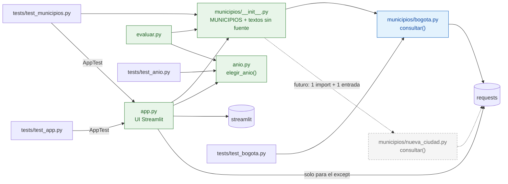

# Arquitectura: selector de municipio

Propuesta del Arquitecto, 2026-09-26. Parte de `CLAUDE.md`, `FUENTES.md`, `FUENTES_MUNICIPIOS.md`
(matriz y diagrama de flujo) y del código actual (`app.py`, `geocodificar.py`, `catastro.py`,
`anio.py`, `evaluar.py`, `tests/`). Línea base verificada hoy: `uv run pytest` → 18 passed.

---

## 1. Propuesta del Arquitecto

> **Nota de la Decisión final:** esta propuesta se aplica con los ajustes de la sección 3. Los
> subtítulos marcados *(ajustado…)* o *(reemplazado…)* tienen partes que ya no valen. Si esta
> sección y la 3 difieren, vale la 3.

### 1.1 Principios

- **Una ciudad = un archivo.** Todo lo que depende de un gestor catastral (URLs, claves,
  normalización de la dirección, nombres de campos, paginación) vive en `municipios/<ciudad>.py`.
- **Un registro = un dict.** `municipios/__init__.py` tiene `MUNICIPIOS`: nombre visible → datos de
  la ciudad. Es la única lista de ciudades. `app.py` y `evaluar.py` solo la leen.
- **Lo común no se copia:** la regla del año (`anio.py`) y los mensajes de la UI (`app.py`) son
  los mismos para todas las ciudades.
- **Nada especulativo:** sin clases base, sin `Protocol`, sin autodescubrimiento de módulos, sin
  archivos de configuración y sin excepciones propias. Hoy solo hay una ciudad con fuente. Con eso
  basta para que la segunda sea fácil.

### 1.2 Árbol de carpetas final

```
Catastro/
├── app.py                    # UI: selectbox municipio + dirección + mensajes (sin lógica de consulta)
├── anio.py                   # COMÚN: elegir_anio(construcciones) -> {"anio", "detalle"} | None
├── municipios/
│   ├── __init__.py           # MUNICIPIOS (registro) + textos de las 5 ciudades sin fuente
│   └── bogota.py             # normalizar_direccion, geocodificar, consultar_predio, consultar
├── evaluar.py                # punta a punta real; elige el adaptador por la columna `municipio`
├── casos_prueba.csv          # sin cambios (solo filas de Bogotá)
├── requirements.txt          # sin cambios (streamlit, requests, pytest)
└── tests/
    ├── conftest.py           # fixture(nombre) + falso_get(*respuestas) compartidos
    ├── test_anio.py          # regla del año con pares literales (sin fixtures de Bogotá)
    ├── test_bogota.py        # = test_normalizar + test_servicios + pruebas de consultar()
    ├── test_municipios.py    # integridad del registro + rama "sin fuente" sin red (AppTest)
    ├── test_app.py           # caracterización de los mensajes de la UI de Bogotá (AppTest)
    └── fixtures/
        ├── bogota/           # los 6 JSON que hoy están en la raíz de fixtures/
        ├── barranquilla/  bucaramanga/  cali/  manizales/  medellin/  nacional/
        │                     # evidencia del Investigador; no los usa ninguna prueba hoy
```

Desaparecen `geocodificar.py`, `catastro.py`, `tests/test_normalizar.py` y
`tests/test_servicios.py` (su contenido pasa a `municipios/bogota.py` y `tests/test_bogota.py`).

**Por qué `municipios/` y no `catastro/`:** si se creara un paquete `catastro/` mientras existe
`catastro.py`, Python importaría el paquete (un directorio con `__init__.py` tiene prioridad sobre el
`.py` del mismo nombre) y `import catastro` se rompería a mitad de la migración sin dar error
claro. Con `municipios/` no hay choque. Además, al terminar no queda ningún módulo `catastro.py`
ni `geocodificar.py`, y desaparece la confusión actual entre el módulo `geocodificar` y la función
`geocodificar.geocodificar`.

**Por qué un solo `bogota.py` (unos 80 líneas) y no `municipios/bogota/` con dos módulos:**
la unidad que se agrega o se quita es la ciudad. Los tres pasos de `CLAUDE.md` siguen separados:
paso 1 = `bogota.geocodificar` (+ `normalizar_direccion`, pura), paso 2 = `bogota.consultar_predio`,
paso 3 = `anio.elegir_anio`. Cada uno se prueba por separado igual que hoy. Lo que cambia es que
los pasos 1 y 2 son funciones del mismo archivo y no módulos distintos. Hay que actualizar la frase
"módulos separados" de `CLAUDE.md` (paso 6 de la migración).

### 1.3 Contrato de una ciudad con fuente *(ajustado en 3.2: excepciones y deduplicación)*

Cada `municipios/<ciudad>.py` con fuente expone **una** función pública que usan la app y
`evaluar.py`:

```python
def consultar(direccion: str) -> dict | None
```

- **Entrada:** el texto tal como lo escribió el usuario. `app.py` ya descartó vacío y solo espacios.
  Cada ciudad normaliza a su propio formato: Bogotá quita `#` y tildes, pero el WFS de Cali
  **necesita** el `#` (`KR 100 # 11 A - 25`). Por eso la normalización no es común.
- **`None`** → "Dirección no encontrada." Incluye el caso de una dirección aproximada sin código
  predial (Bogotá: `geocodificar_aproximada_sin_lote.json`).
- **Ficha (dict)** con exactamente estas claves:

| Clave | Tipo | Bogotá | Uso |
|---|---|---|---|
| `direccion_oficial` | `str \| None` | `dirtrad` (`"CL 48 S 4B 42 E"`) | aviso de aproximada y pie de resultado |
| `aproximada` | `bool` | `tipo_direccion != "Asignada por Catastro"` | aviso en la UI |
| `codigo` | `str` | `lotcodigo` (`"001328010005"`) | pie de resultado y columna de `evaluar.py` |
| `construcciones` | `list[tuple]` | `[(PREVETUSTZ, PREAUSO), ...]`, un par por fila | entrada de `anio.elegir_anio` |

  `construcciones` va **cruda**: pares `(año, área_m2)` con `año` `int|None` y `área` `float|None`,
  sin filtrar ni sumar. Descartar nulos y ceros, sumar el área por año y resolver empates es trabajo
  de `anio.py`, igual para todas las ciudades. Quitar filas repetidas **sí** es del adaptador, porque
  depende de la fuente (Bogotá lo hace con `returnDistinctValues` + `orderByFields`; en el RIC habría
  que hacerlo a mano).

  Ejemplo real (fixtures `geocodificar_cl48sur_4b42este.json` + `predio_lote_001328010005.json`):
  `{"direccion_oficial": "CL 48 S 4B 42 E", "aproximada": False, "codigo": "001328010005",
  "construcciones": [(2012, 51.6), (1984, 204.6)]}`.

- **Excepciones** (las mismas que ya captura `app.py`, sin clases propias):
  - `requests.RequestException` → "Servicio no disponible. Intenta de nuevo más tarde." Cubre
    timeout, error HTTP, error que el servicio declara en el JSON (`{"status": false}` de la
    apikey, `{"error": ...}` de ArcGIS) y JSON inválido (`requests.JSONDecodeError` hereda de
    `RequestException` y de `ValueError`; verificado con requests 2.34.2).
  - `ValueError` → el mismo mensaje. Es para respuestas con forma inesperada o códigos que no pasan
    la validación (hoy: `lotcodigo.isdigit()`, que además bloquea inyección en `where`).
  - **Ninguna otra.** El adaptador lee los campos con `.get()` y convierte lo inesperado en
    `ValueError`, para que un `KeyError` no llegue a la UI como traza.

Regla del año, sin cambios: `anio.elegir_anio(construcciones)` descarta años nulos o 0, suma
`max(área or 0, 0)` por año, toma como principal el año de mayor área y, si hay empate, el más
antiguo. Devuelve `{"anio": int, "detalle": [(anio, area), ...]}` ordenado por área descendente,
o `None`.

### 1.4 Registro `MUNICIPIOS` y ciudades sin fuente *(textos definitivos en 3.4)*

`municipios/__init__.py` contiene un docstring corto con el contrato (que remite a este archivo),
`from . import bogota` y un dict **ordenado**. Bogotá va primero, así que es la opción por defecto
del selectbox. Todas las entradas tienen `gestor` y `consultar`. La ciudad **no tiene fuente**
cuando `consultar` es `None`. No hay un campo `estado` aparte: con él se podría escribir
`"disponible"` sin función, o al revés.

```python
MUNICIPIOS = {
    "Bogotá": {"gestor": "Catastro Bogotá", "consultar": bogota.consultar, "nombre_codigo": "Lote"},
    "Medellín": {
        "gestor": "...",
        "consultar": None,
        "motivo": "...",           # 1-2 frases, en lenguaje de usuario, con fecha de revisión
        "consulta_manual": "...",  # markdown: dónde/cómo + enlace https oficial (.gov.co)
    },
    # Cali, Barranquilla, Bucaramanga, Manizales: igual que Medellín
}
```

- `gestor` de Bogotá = `"Catastro Bogotá"`. Así el spinner `f"Consultando {gestor}..."` sigue
  mostrando exactamente "Consultando Catastro Bogotá...".
- `nombre_codigo` solo existe en ciudades con fuente. Mantiene el pie "Dirección catastral: ... ·
  Lote: ...". En otra ciudad será `"NPN"`, `"CBML"`, etc.
- Los textos de las ciudades sin fuente viven **solo** aquí, como datos. `app.py` no tiene ningún
  texto por ciudad. El detalle técnico sigue en `FUENTES_MUNICIPIOS.md`.

Borrador de textos, tomado de `FUENTES_MUNICIPIOS.md`. El Programador puede ajustar la redacción,
pero no los hechos:

| Municipio | `gestor` | `motivo` | `consulta_manual` |
|---|---|---|---|
| Medellín | Catastro de Medellín (Subsecretaría de Catastro del Distrito) | Las capas catastrales públicas (lotes y construcciones) y MEData no incluyen el año de construcción; además el portal de mapas del Distrito respondía 404 al revisarlo (2026-09-26). | Ficha o certificado catastral en línea, por matrícula o CBML: https://www.medellin.gov.co → Trámites y servicios. |
| Cali | Subdirección de Catastro, Departamento Administrativo de Hacienda de Cali | El Geoportal Catastral y la IDESC publican terrenos y construcciones, pero sin año de construcción (revisado 2026-09-26). | Certificado catastral, trámite presencial y pagado en el CAM: https://www.cali.gov.co/hacienda/publicaciones/164112/como-tramitar-facil-y-rapido-su-certificado-catastral/ |
| Barranquilla | Gerencia de Gestión Catastral de Barranquilla | El catastro publicado (2025) tiene el campo de año, pero vale 0 en el 99,9 % de las construcciones (revisado 2026-09-26). | "Identifica tu predio" o Catastro Virtual (con registro): https://catastro.barranquilla.gov.co/identifica-tu-predio/ |
| Bucaramanga | Área Metropolitana de Bucaramanga (AMB) | Los datos catastrales abiertos del AMB tienen el campo de año, pero vacío en todos los registros (revisado 2026-09-26). | Visor catastral del AMB (pide inicio de sesión): https://www.amb.gov.co/consultas-catastro/ |
| Manizales | MASORA (gestor catastral por contrato) | La única consulta del gestor exige registro, captcha y pago, y el reporte nacional del IGAC trae el año vacío (revisado 2026-09-26). | Portal SISMAS de MASORA (registro y pago) u oficina en Manizales: https://masora.gov.co/gestion-catastral-manizales/ |

### 1.5 Cambios por archivo *(ajustado en 3.1 y 3.3: `try` de `app.py`, `evaluar.py` y pruebas)*

**`app.py`.** Solo UI. Importa `MUNICIPIOS`, `elegir_anio`, `requests` (solo para el `except`) y
`streamlit`. Orden de la página:

1. `st.title("Año de construcción")`. Es el único texto que cambia: hoy dice "... - Bogotá".
2. `nombre = st.selectbox("Municipio", list(MUNICIPIOS))` y `municipio = MUNICIPIOS[nombre]`.
3. Si `municipio["consultar"] is None`: `st.warning("Sin fuente oficial pública para este
   municipio.")`, luego una línea con gestor y motivo, luego "Dónde consultarlo a mano:" con
   `consulta_manual`, y `st.stop()`. **No se muestra el campo de dirección ni se llama a la red.**
   El mensaje aparece al elegir la ciudad, sin obligar a escribir una dirección que no se va a usar.
   Si el usuario vuelve a Bogotá, el campo de dirección aparece vacío (Streamlit borra el estado de
   los widgets que no se dibujan). Es aceptable.
4. Todo lo demás queda igual que hoy. Solo cambian dos cosas: `ubicacion = geocodificar(...)` +
   `consultar_predio(...)` pasan a ser `ficha = municipio["consultar"](direccion)`, y
   `extraer_anio(...)` pasa a ser `elegir_anio(ficha["construcciones"])`. También se mantienen los
   mensajes, en el mismo orden: "Escribe una dirección.", "Servicio no disponible. Intenta de nuevo
   más tarde.", "Dirección no encontrada.", "Dirección aproximada: se usó X. El predio podría no ser
   el que buscas.", "Predio sin año de construcción registrado.", la métrica, "Dirección catastral:
   X · Lote: Y" (con `nombre_codigo`), "Construcciones en el lote:" y el desglose. "Lote" en
   "Construcciones en el lote" es genérico y sirve para cualquier ciudad, así que no se parametriza.

**`anio.py`.** `extraer_anio(registros: list[dict])` pasa a ser `elegir_anio(construcciones:
list[tuple])`. El cuerpo es el mismo: en vez de `r.get("PREVETUSTZ")` y `r.get("PREAUSO")` desempaca
`anio, area`. El docstring conserva la regla y deja de nombrar campos de Bogotá.

**`evaluar.py`.** Por cada fila, `m = MUNICIPIOS.get(fila["municipio"])`. Si no existe o no tiene
`consultar`, `obtenido = "sin fuente"` y la fila cuenta como fallo, porque `anio_esperado` es un año.
Si tiene, llama a `m["consultar"]` + `elegir_anio`. La tabla gana la columna Municipio y "Lote" pasa
a llamarse "Código". Al final imprime `Bogotá: 8/8 = 100 %`, una línea por municipio. El código de
salida es 0 solo si **cada** municipio llega a ≥ 80 %, para que una ciudad nueva con 50 % no quede
tapada por el 100 % de Bogotá. Las ciudades sin fuente **no** se agregan a `casos_prueba.csv`: no
hacen llamadas y su comportamiento se prueba en pytest. Así se conserva el "8/8".

**Tests.**
- `conftest.py`: se conserva `fixture(nombre)` (ahora con nombres tipo `"bogota/xxx.json"`). Se suma
  un fixture `falso_get(*respuestas)` que sale de `test_servicios.py`: reemplaza `requests.get`,
  devuelve la lista de `params` de las llamadas y acepta dicts (JSON) o instancias de excepción (para
  simular `requests.Timeout`). La clase `Resp` se puede cambiar por `types.SimpleNamespace`.
- `test_bogota.py`: las 7 de `test_normalizar` y las 7 de `test_servicios`, apuntando a
  `municipios.bogota`, más `consultar()` en tres casos: exacta con 2 construcciones → ficha del
  ejemplo, fallo → `None`, apikey inválida → `RequestException`.
- `test_anio.py`: las mismas 4 reglas con pares literales. Los casos de los fixtures se copian como
  números: `[(2012, 51.6), (1984, 204.6)]` da 1984, y 1971 vs 2021 con 1000.91 / 11.52 m².
- `test_app.py` (nuevo, **antes** de mover nada): `AppTest.from_file("app.py")` con `falso_get` y
  los fixtures de Bogotá fija el texto exacto de cada mensaje de la lista de arriba. Probado hoy
  contra el `app.py` actual: da métrica `1984`, pie `Dirección catastral: CL 48 S 4B 42 E · Lote:
  001328010005` y desglose, sin red. Si pasa sin cambios al final, la UI de Bogotá no cambió. No
  debe comprobar el título.
- `test_municipios.py` (nuevo): (a) el orden de las claves es Bogotá, Medellín, Cali, Barranquilla,
  Bucaramanga, Manizales; (b) toda entrada tiene `gestor`; si tiene `consultar`, es callable y tiene
  `nombre_codigo`; si no, `motivo` y `consulta_manual` no están vacíos y `consulta_manual` contiene
  `https://` y `.gov.co`; (c) todo `municipio` de `casos_prueba.csv` existe en el registro y tiene
  `consultar`, lo que detecta errores de escritura sin red; (d) AppTest parametrizado con las 5
  ciudades sin fuente: aparece "Sin fuente oficial pública para este municipio", no hay
  `text_input` y `falso_get` registra 0 llamadas.

**Fixtures.** Los 6 JSON de Bogotá pasan a `tests/fixtures/bogota/`, así ninguna ciudad es la
excepción. Hay que actualizar las rutas en `FUENTES.md` (5), `CLAUDE.md` (1) y la nota de
`casos_prueba.csv` (1). `EVALUACION.md` es un registro histórico y no se toca. Las subcarpetas del
Investigador quedan como evidencia.

### 1.6 Plan de migración de Bogotá *(reemplazado por 3.3)*

Al final de **cada** paso: `uv run pytest` en verde y `uv run python evaluar.py` = 8/8.

| Paso | Qué se hace | Archivos | Verificación extra |
|---|---|---|---|
| 0. Línea base | Correr ambos comandos y guardar la tabla de `evaluar.py` para comparar. | ninguno | 18 passed, 8/8 |
| 1. Red de seguridad | Pasar `falso_get` a `conftest.py`. Escribir `tests/test_app.py` contra la app **actual**. | `tests/conftest.py`, `tests/test_servicios.py`, `tests/test_app.py` | test_app pasa sin tocar la app |
| 2. Crear el paquete (copiar, no mover) | `municipios/bogota.py` = `geocodificar.py` + `catastro.py` (constantes `URL_GEOCODIFICADOR`, `URL_PREDIO`, un solo `TIMEOUT`) + `consultar()`. `municipios/__init__.py` solo con Bogotá. `tests/test_bogota.py`. Los módulos viejos siguen y la app todavía los usa. | `municipios/*`, `tests/test_bogota.py` | tests viejos y nuevos pasan a la vez |
| 3. Cambiar las llamadas | `anio.extraer_anio` → `elegir_anio(pares)`. `app.py` usa `MUNICIPIOS["Bogotá"]` (todavía sin selectbox) y `evaluar.py` elige por fila. `test_anio.py` con pares. | `anio.py`, `app.py`, `evaluar.py`, `tests/test_anio.py` | **test_app.py sin cambios** en verde; `evaluar.py` igual a la línea base |
| 4. Borrar lo viejo | Borrar `geocodificar.py`, `catastro.py`, `tests/test_normalizar.py`, `tests/test_servicios.py`. | borrados | grep A (abajo) → nada |
| 5. Selector + 5 ciudades | Agregar las 5 entradas sin fuente. Agregar el selectbox y la rama sin fuente a `app.py`. `tests/test_municipios.py`. | `municipios/__init__.py`, `app.py`, `tests/test_municipios.py` | test_app sigue en verde (Bogotá es la opción por defecto) |
| 6. Orden y documentación | Mover los fixtures de Bogotá a `tests/fixtures/bogota/` y actualizar las rutas. En `CLAUDE.md`: "Estado del repositorio", "Objetivo" (selector), "Arquitectura prevista" (remite a este archivo y cambia "módulos" por "funciones en `municipios/<ciudad>.py`"). | fixtures, `conftest`/tests, `FUENTES.md`, `CLAUDE.md`, `casos_prueba.csv` | grep B (abajo) → nada |

```bash
# A (paso 4): ningún import de los módulos viejos ni de extraer_anio (hoy: 18 líneas)
grep -rnE "^(from|import) (geocodificar|catastro)|extraer_anio" --include=*.py --exclude-dir=.venv .
# B (paso 6): ninguna ruta a un JSON en la raíz de fixtures (hoy: FUENTES.md x4, casos_prueba.csv x1).
# Revisar a mano también FUENTES.md:4 y CLAUDE.md ("Bogotá en la raíz").
grep -rn "tests/fixtures/[^/\` ]*\.json" *.md *.csv
```

Manual al final: `uv run streamlit run app.py`. Probar Bogotá con "Calle 48 Sur # 4B-42 Este" (1984
y desglose) y elegir Cali (mensaje sin fuente, sin campo de dirección).

### 1.7 Receta: agregar una ciudad cuando publique el año *(ajustada en 3.5)*

1. **Verificar y anotar.** Con `curl`, comprobar dirección → código predial y código → filas con
   año **y** área, y que el año venga lleno de verdad (conteo `IS NOT NULL` / `> 0`). Anotar URL,
   parámetros y campos en `FUENTES_MUNICIPIOS.md` y en "Hallazgos verificados" de `CLAUDE.md`.
   Guardar las respuestas crudas en `tests/fixtures/<ciudad>/`.
2. **Escribir `municipios/<ciudad>.py`** con `consultar(direccion) -> dict | None` según el contrato
   de 1.3: normalizador propio, URLs como constantes, `timeout=15` en cada `requests.get`,
   `.get()` para leer campos, `RequestException`/`ValueError` para fallas del servicio, filas
   repetidas quitadas y `construcciones` crudas (sin filtrar 0/nulos).
3. **Registrar:** en `municipios/__init__.py`, `from . import <ciudad>`, y en la entrada de la
   ciudad cambiar `motivo`/`consulta_manual` por `"consultar": <ciudad>.consultar,
   "nombre_codigo": "<NPN|CBML|...>"`. No se toca `app.py`, `anio.py`, `evaluar.py` ni `bogota.py`.
4. **Probar:** `tests/test_<ciudad>.py` con `falso_get` y los fixtures (encontrada, no encontrada,
   error del servicio, varias construcciones). Agregar ≥ 3 filas a `casos_prueba.csv` con el año
   comprobado por otra vía. `uv run pytest` y `uv run python evaluar.py` (la ciudad nueva ≥ 80 %).
   `test_municipios.py` pasa sin cambios porque la ciudad ya estaba en la lista.

### 1.8 Diagramas

Módulos (flecha = "importa"). Ninguna ciudad importa `anio.py` ni el registro, y las ciudades no se
importan entre sí.



Correspondencia con el diagrama de flujo del Investigador (`FUENTES_MUNICIPIOS.md`, "Diagrama de
flujo"):

| Nodos del Investigador | Dónde viven |
|---|---|
| `IN`, `SEL` | `app.py` (selectbox + text_input) |
| `NORM` | `bogota.normalizar_direccion`. **Cambia:** la limpieza no es común, es de cada ciudad (Cali necesita el `#`, ver Riesgos del Investigador). |
| `B1`–`B5` y el indicador `aproximada` | `municipios/bogota.py` (`geocodificar`, `consultar_predio`, `consultar`) |
| `AG`, `AGR` | `anio.elegir_anio` |
| `NF`, `ND`, `AV`, `SA`, `OUT` (mensajes) | `app.py`; en `evaluar.py` como texto de la tabla |
| `M0`…`Z0`, `SF` | textos en `municipios/__init__.py`; rama sin red en `app.py` |
| `R1`–`R3` | no se implementan (dan el código predial, pero no el año) |

### 1.9 Estimación de líneas *(recalculada en 3.2)*

| Archivo | Hoy | Propuesto | Nota |
|---|---|---|---|
| `app.py` | 39 | ~50 | +2 selectbox, +5 rama sin fuente; el resto es igual |
| `anio.py` | 23 | ~23 | misma regla; entrada en pares |
| `geocodificar.py` | 39 | 0 | pasa a `bogota.py` |
| `catastro.py` | 33 | 0 | pasa a `bogota.py` |
| `municipios/bogota.py` | — | ~80 | 72 movidas − ~6 duplicadas + ~14 de `consultar()` |
| `municipios/__init__.py` | — | ~50 | ~10 de docstring/import, ~5 de Bogotá, ~35 de **textos** de las 5 ciudades |
| **Código de la app** | **134** | **~203** | lógica: **+~25 líneas** (+19 %); textos: ~+45 |
| `evaluar.py` | 34 | ~42 | columna municipio, resumen y umbral por municipio |
| tests (`.py`) | 133 | ~210 | + `test_app.py` (~45), + `test_municipios.py` (~30) |

(`EVALUACION.md` contó 131 antes de las dos correcciones posteriores. Hoy `wc -l` da 134.) Casi
todo el crecimiento son textos para el usuario, no lógica. Cada ciudad futura con fuente suma su
archivo (~50–80) y ~1 línea neta en el registro.

### 1.10 Descartado a propósito

- **Clase base, `Protocol` o ABC para las ciudades:** el contrato es una función y un dict. Lo
  documenta 1.3 y lo verifican `test_municipios.py` y las pruebas de cada ciudad.
- **Autodescubrir módulos (`importlib`, recorrer `municipios/`):** con una línea de registro
  explícita se ve de un vistazo qué ciudades hay.
- **Excepciones propias** (`ServicioNoDisponible`, `NoEncontrada`): bastan `None`,
  `RequestException` y `ValueError`, que ya usa la app.
- **Normalizador común:** los formatos oficiales son incompatibles entre ciudades.
- **Adaptador común vía RIC del IGAC:** hoy el año viene nulo en los 8 millones de registros. Si
  algún día se llena, será *un* archivo `municipios/ric.py` compartido por varias entradas del
  registro, sin cambiar el contrato.
- **Textos en JSON/TOML**, `st.cache_data`, placeholder de dirección por ciudad, etiqueta
  "(sin fuente)" en el selectbox: no hacen falta para ir de la dirección al año.

---

## 2. Revisión del Programador

Revisión del 2026-09-26 contra el código actual (`uv run pytest` → 18 passed). Comprobado con
AppTest en el scratchpad, sin tocar el proyecto: con `requests.get` falso, el `app.py` actual da la
métrica 1984, el pie y el desglose, y un `Timeout` da "Servicio no disponible". Con `st.stop()` antes
del campo de dirección, al volver a Bogotá el campo queda vacío. `requests.JSONDecodeError` hereda de
`RequestException` y de `ValueError`.

1. **Objeción (alcance).** Lo único que el usuario ve es el paso 5. Los pasos 1–4 y 6 preparan una
   segunda ciudad con fuente que hoy no existe: ninguna de las 5 publica el año y el RIC tiene 0 años
   en 8.016.896 registros. Para que Bogotá funcione igual que hoy, el plan toca ~17 archivos más
   6 fixtures, sin git. Es la preparación "por si acaso" que CLAUDE.md excluye, y el contrato de 1.3
   se diseña con un solo ejemplo real (ver 8). **Propuesta: plan mínimo.**
   - `municipios.py`: un archivo, no un paquete. Contiene `SIN_FUENTE = {"Medellín": {"gestor",
     "motivo", "consulta_manual"}, ...}` y `MUNICIPIOS = ["Bogotá", *SIN_FUENTE]`.
   - `app.py`: título nuevo, `selectbox` y la rama sin fuente de 1.5 (3) con `if nombre in
     SIN_FUENTE: ...; st.stop()`. Debajo, el código de Bogotá queda **igual**.
   - No se tocan `geocodificar.py`, `catastro.py`, `anio.py`, `evaluar.py`, los fixtures ni
     `FUENTES.md`. En CLAUDE.md solo cambian "Estado" y "Objetivo".
   - Cuesta ~+50 líneas de código (casi todo textos) y ~+20 de pruebas. Las secciones 1.3 y 1.7
     quedan aquí como plan para el día en que otra ciudad publique el año.
   - **Pregunta para la decisión:** ¿el usuario pidió dejar la estructura lista para más ciudades?
     Si la pidió, plan del Arquitecto con los ajustes 3, 4 y 7. Si no, plan mínimo.
2. **De acuerdo** (si se migra): un solo `bogota.py`. Los pasos siguen siendo funciones que se
   prueban por separado, y lo que se agrega o se quita es la ciudad. Con el plan mínimo la pregunta
   no aplica, porque los módulos actuales y esa frase de CLAUDE.md no cambian.
3. **De acuerdo:** la regla del año va fuera de la ciudad y `extraer_anio` pasa a llamarse
   `elegir_anio`. El cambio de nombre tiene una razón más: si un llamado viejo le pasa los dicts de
   Bogotá, al desempacar `anio, area` salta `ValueError: too many values to unpack` (comprobado) y
   `app.py` lo muestra como "Servicio no disponible". Con el nombre nuevo, el llamado viejo falla con
   un `ImportError` visible. **Objeción menor:** dentro del `try` de `app.py` debe quedar solo
   `consultar(...)` y `elegir_anio` debe ir fuera. Hoy `extraer_anio` está dentro (línea 18), así que
   un error de programación en la regla aparece como una caída del servicio.
4. **Objeción (sobran cambios y pruebas).**
   - Mover los fixtures de Bogotá a `bogota/` cambia 7 rutas en 3 documentos y los nombres en los
     tests, sin cambiar ningún comportamiento. CLAUDE.md ya dice "Bogotá en la raíz". No moverlos.
   - Con un solo municipio en el CSV, el umbral por municipio de `evaluar.py` da lo mismo que el
     actual. Agregarlo cuando haya filas de otra ciudad.
   - `test_municipios` (a) compara el orden del dict con una copia del mismo dict: quitarla. (d) corre
     5 AppTest del mismo código con datos distintos, y (b) ya valida los datos de las 5 ciudades:
     basta un AppTest. Se quedan (b), (c) y un AppTest.
   - `test_app.py`: **De acuerdo** solo si se migra, porque es la red de seguridad. Bastan 3 casos:
     exacta con desglose, no encontrada y servicio no disponible. Fijar el texto exacto de cada
     mensaje rompe la prueba con cualquier cambio de redacción. La ruta relativa de
     `AppTest.from_file("app.py")` se resuelve desde el archivo de prueba y da `tests/app.py` →
     `FileNotFoundError` (comprobado). Usar `Path(__file__).parent.parent / "app.py"`.
   - Mostrar el aviso "sin fuente" al elegir la ciudad, sin campo de dirección: **De acuerdo.** Es más
     simple y no llama a la red.
5. **De acuerdo:** la normalización va por ciudad. Cali necesita `#` y ` - `, Barranquilla usa
   palabras completas sin `#` y Bogotá quita el `#`. El nodo `NORM` común del diagrama del
   Investigador borraría el `#` antes de llegar a Cali. `normalizar_direccion` de Bogotá debe seguir
   pura, con sus 7 casos. No hay nada que agregar hoy.
6. **Objeción (textos de las ciudades sin fuente).**
   - "Dónde consultarlo a mano:" promete el año. Sin embargo, FUENTES_MUNICIPIOS.md dice que no se
     pudo ver qué muestran las rutas de Medellín y Barranquilla, y que el geoportal de Cali no tiene
     año. Usar un rótulo que no lo prometa, p. ej. "Consulta directa con el gestor:".
   - El `motivo` de Medellín mezcla la razón de fondo (no hay campo de año) con el 404 del
     2026-09-26, que pronto dejará de ser cierto. En la UI dejar solo la razón de fondo; el 404 ya
     está en FUENTES_MUNICIPIOS.md.
7. **Objeción (riesgos de la migración), si se hace.**
   - El proyecto **no tiene git**, el paso 4 borra archivos y el paso 6 mueve fixtures. Antes del
     paso 1, hacer una copia con `cp -a` o pedir permiso al usuario para `git init` (es local; no es
     infraestructura).
   - `evaluar.py` usa la red real y consulta lotes PH de 289 y 490 filas. Correrlo al final de cada
     paso hace que la migración dependa de dos servicios externos. Basta en los pasos 0, 3 y 6; en
     los demás, `pytest` + `test_app.py` cubren el mismo camino sin red.
   - "Ninguna otra" excepción obliga a reescribir código que funciona (`f["attributes"]` en
     `catastro.py`). Mejor seguir capturando `RequestException`/`ValueError` como hoy. Si el esquema
     cambia de forma inesperada, una traza en una app local es más fácil de diagnosticar.
8. **Pregunta (¿el contrato sirve para Cali y Barranquilla si publican el año?)** Sirve para el caso
   simple: dirección exacta → un NPN → construcciones con año y área, y `anio.py` ya descarta el `0`.
   No sirve para lo que Bogotá resuelve en el servidor a nivel de lote:
   (a) una dirección que coincide con varios NPN (PH con `AP 101`/`LC 121`, duplicados de
   Barranquilla, `LIKE` en Cali). Con `dict | None` hay que elegir uno o agregar por terreno
   (primeros 21 dígitos del NPN), y eso cambia qué es `codigo`.
   (b) `aproximada` no tiene equivalente en una búsqueda por igualdad.
   En el RIC hay que quitar duplicados por fila completa (`identificador`), nunca por el par
   `(año, área)`. Lo más probable es que el contrato cambie con la segunda ciudad, y eso refuerza el
   punto 1.
9. **De acuerdo (estimación de líneas):** coincide con el código (72 líneas movidas, ~14 de
   `consultar`, ~35 de textos). Aun así, la comparación útil es con el plan mínimo: ~+50 de código y
   ~+20 de pruebas en 3 archivos (más CLAUDE.md), frente a ~+70 de código y ~+77 de pruebas en
   ~17 archivos más 6 fixtures.

---

## 3. Decisión final

Arquitecto, 2026-09-26. Responde a la revisión del Programador (sección 2).

**Dato que resuelve el punto 1.** El orquestador transmitió lo que pidió el usuario: un Arquitecto
que "estructure la carpeta del código para que este sea escalable manteniendo las normas originales.
Es decir, código python y simple". Entonces la estructura para más ciudades **sí** se pidió ahora.
Se aplica la sección 1 con los ajustes 3, 4 y 7, que es lo que el Programador propuso para este
caso, y con los recortes aceptados abajo. Si esta sección y la 1 difieren, vale esta.

### 3.1 Respuesta punto por punto

| Punto de la revisión | Decisión | Motivo |
|---|---|---|
| 1. Plan mínimo (`municipios.py` suelto, Bogotá sin migrar) | Rechazado | El usuario pidió la estructura escalable ahora; el plan mínimo solo agrega el selector. |
| 2. Un solo `municipios/bogota.py` | Aceptado | La unidad que se agrega o se quita es la ciudad. |
| 3. `elegir_anio(pares)` y fuera del `try` | Aceptado | Un llamado viejo falla con `ImportError` y un error en la regla ya no aparece como "Servicio no disponible". |
| 4a. No mover los fixtures de Bogotá | Rechazado | Es parte de la estructura de carpetas pedida. Se copian en el paso 1, así las pruebas nuevas usan `bogota/…` desde el principio. Cuesta 7 rutas en documentos, controladas con `grep`. |
| 4b. Umbral por municipio en `evaluar.py` | Aceptado | Con un solo municipio da lo mismo. Tampoco se agrega la columna Municipio, así la salida queda idéntica a la línea base. Se agregan con la primera ciudad nueva (3.5). |
| 4c. `test_municipios`: quitar (a) y dejar un AppTest | Aceptado | (a) compara el dict consigo mismo y (b) ya valida los datos de las 5. `test_app.py` comprueba que Bogotá sea la opción por defecto. |
| 4d. `test_app.py`: 3 casos, sin texto exacto | Modificado | Son 4 casos: se suma "aproximada + sin año", dos ramas que la migración toca (probado hoy). El texto sí es exacto, porque la condición es que los mensajes de Bogotá no cambien. No se comprueban título, spinner ni placeholder. |
| 4d. Ruta de `AppTest.from_file` | Aceptado | `Path(__file__).parent.parent / "app.py"`. |
| 4e. Aviso sin fuente y sin campo de dirección | Aceptado | Ya había acuerdo. |
| 5. Normalización por ciudad | Aceptado | Hoy no cambia nada. |
| 6a. Rótulo que no prometa el año | Aceptado | "Consulta directa con el gestor:" (3.4). |
| 6b. Motivo de Medellín sin el 404 | Aceptado | El 404 es pasajero y ya está en `FUENTES_MUNICIPIOS.md`. |
| 7a. Respaldo (no hay git) | Modificado | `tar` del proyecto sin `.venv` en el scratchpad antes del paso 1. No se hace `git init`: CLAUDE.md dice "sin git" y el usuario no lo pidió. |
| 7b. `evaluar.py` solo en hitos | Aceptado | Se corre en los pasos 0, 3 y 6. |
| 7c. Quitar "Ninguna otra" excepción | Aceptado | El código de Bogotá se mueve tal cual. Lo inesperado sale como traza, que es más útil en una app local. |
| 8. ¿Sirve el contrato para Cali o Barranquilla? | Aceptado como límite | Es el contrato v1 y solo se probó con Bogotá (reglas en 3.2). Si hay varios NPN, se agrega por terreno. Si la ciudad no cabe, se cambia el contrato ese día: solo lo leen `app.py` y `evaluar.py`. |
| 8. Deduplicar por fila completa, no por `(año, área)` | Aceptado | Dos unidades distintas pueden tener el mismo año y la misma área. |
| 9. Estimación | Aceptado | Recalculada en 3.2. |

### 3.2 Estructura y contrato definitivos

```
Catastro/
├── app.py                  # UI: selectbox de municipio + dirección + mensajes (sin lógica de consulta)
├── anio.py                 # COMÚN: elegir_anio(construcciones)
├── municipios/
│   ├── __init__.py         # MUNICIPIOS: la única lista de ciudades (Bogotá + textos de las 5 sin fuente)
│   └── bogota.py           # normalizar_direccion, geocodificar, consultar_predio, consultar
├── evaluar.py              # punta a punta real; elige la ciudad por la columna `municipio`
├── casos_prueba.csv        # las mismas 8 filas; solo cambia una ruta dentro de una nota
├── requirements.txt        # sin cambios
├── CLAUDE.md  FUENTES.md  FUENTES_MUNICIPIOS.md  EVALUACION.md  ARQUITECTURA.md
└── tests/
    ├── conftest.py         # fixtures de pytest: fixture(nombre) y falso_get(*respuestas)
    ├── test_anio.py        # 4: regla del año con pares literales
    ├── test_bogota.py      # 17: 7 de normalizar + 7 de servicios + 3 de consultar()
    ├── test_municipios.py  # 3: registro, CSV y un AppTest de ciudad sin fuente
    ├── test_app.py         # 4: AppTest de los mensajes de Bogotá, texto exacto
    └── fixtures/
        ├── bogota/         # los 6 JSON que hoy están en la raíz de fixtures/
        └── barranquilla/  bucaramanga/  cali/  manizales/  medellin/  nacional/   # sin cambios
```

Se borran `geocodificar.py`, `catastro.py`, `tests/test_normalizar.py`, `tests/test_servicios.py` y los
6 JSON de la raíz de `tests/fixtures/`.

```python
# anio.py (COMÚN)
def elegir_anio(construcciones: list[tuple]) -> dict | None
#   {"anio": int, "detalle": [(anio, area_m2), ...]} ordenado por área descendente; None si no hay años válidos

# municipios/__init__.py (REGISTRO): el orden es el del selectbox y Bogotá va primero (opción por defecto)
MUNICIPIOS: dict[str, dict]
#   con fuente: {"gestor": str, "consultar": <función>, "nombre_codigo": str}
#   sin fuente: {"gestor": str, "consultar": None, "motivo": str, "consulta_manual": str}

# municipios/<ciudad>.py: lo único que usan app.py y evaluar.py
def consultar(direccion: str) -> dict | None
#   {"direccion_oficial": str | None, "aproximada": bool, "codigo": str,
#    "construcciones": [(anio: int | None, area_m2: float | None), ...]}

# municipios/bogota.py: funciones internas, cada una con sus pruebas
def normalizar_direccion(texto: str) -> str           # pura
def geocodificar(direccion: str) -> dict | None       # {"lotcodigo", "direccion_oficial", "aproximada"}
def consultar_predio(lotcodigo: str) -> list[dict]    # filas crudas de la tabla Predio

# evaluar.py
def evaluar(ruta="casos_prueba.csv") -> float         # % global de aciertos, como hoy

# tests/conftest.py (fixtures de pytest)
fixture(nombre: str) -> dict       # ruta relativa a tests/fixtures/, p. ej. "bogota/geocodificar_fallo.json"
falso_get(*respuestas) -> list     # reemplaza requests.get y exige timeout en cada llamada. Cada respuesta
                                   # es un dict (el JSON) o una excepción, que se lanza. Devuelve los params
                                   # de cada llamada.
```

Reglas del contrato (v1, probado solo con Bogotá):

- `None` significa "no encontrada". Incluye la dirección aproximada que llega sin código predial.
- `construcciones` va cruda: el adaptador no filtra nulos ni ceros y no suma áreas, porque eso lo
  hace `anio.py`. Las filas repetidas sí las quita el adaptador, comparando la fila completa de la
  fuente y nunca el par `(año, área)`.
- `codigo` es el identificador que consultó el adaptador (en Bogotá, el lote). Si una dirección
  devuelve varios códigos (PH), el adaptador agrega por terreno, como hace Bogotá por lote. Si la
  búsqueda es por igualdad exacta, `aproximada` vale `False`.
- Si el servicio falla, el adaptador lanza `requests.RequestException` o `ValueError`, y la app
  muestra "Servicio no disponible". Las demás excepciones (p. ej. `KeyError` porque cambió la forma
  de la fuente) **no** se capturan y salen como traza. Así queda anulado "Ninguna otra" de 1.3.

`app.py` final, en orden: título → `selectbox` → si `consultar is None`, rama sin fuente y
`st.stop()` → campo de dirección y botón → dentro del `try` **solo** `ficha =
municipio["consultar"](direccion)`, con `except (requests.RequestException, ValueError)` → "no
encontrada" → aviso de aproximada → `resultado = elegir_anio(ficha["construcciones"])` → "sin año"
o métrica, pie y desglose.

Tamaño esperado: código de la app ~200 líneas (hoy 134): `app.py` ~50, `anio.py` ~23,
`municipios/__init__.py` ~50 (casi todo textos), `bogota.py` ~80. `evaluar.py` queda en ~34. Pruebas
~200 líneas (hoy 133). Al final debe dar **28 passed** (4 + 17 + 3 + 4).

### 3.3 Pasos de implementación

`S=/tmp/claude-1000/-home-golo-Projects-Catastro/95d15db5-ad97-42cc-9388-d0885f54463f/scratchpad`.
`evaluar.py` usa la red real y solo se corre en los pasos 0, 3 y 6. En los demás pasos basta con
`uv run pytest -q`. No hacer `git init`. Si un hito falla, no avanzar.

0. **Línea base** (con red). Correr `uv run pytest -q` y `uv run python evaluar.py > $S/evaluar_base.txt`.

   ✔ Da 18 passed, y el archivo termina en `Aciertos: 8/8 = 100 %`.

1. **Respaldo y red de seguridad** (sin red).
   - `tar --exclude=.venv --exclude=__pycache__ --exclude=.pytest_cache -czf $S/catastro_pre_migracion.tar.gz -C /home/golo/Projects Catastro`
   - `mkdir tests/fixtures/bogota && cp tests/fixtures/*.json tests/fixtures/bogota/`. Se copian;
     la raíz se borra en el paso 4.
   - En `tests/conftest.py`, agregar el fixture `falso_get` (3.2). `test_servicios.py` no se toca.
   - Escribir `tests/test_app.py` contra el `app.py` **actual**, con `AppTest.from_file(Path(__file__).parent.parent / "app.py")`,
     fixtures `bogota/…` y texto exacto en cuatro casos:
     - **a. Exacta:** `bogota/geocodificar_cl48sur_4b42este.json` + `bogota/predio_lote_001328010005.json`
        → métrica 1984, pie `Dirección catastral: CL 48 S 4B 42 E · Lote: 001328010005`,
        `Construcciones en el lote:`, `- 1984: 204.6 m²` y `- 2012: 51.6 m²`.
     - **b. Aproximada sin año:** el mismo geocodificador con `tipo_direccion = "Dirección por aproximación"`
        y el predio `{"features": []}` → aviso `Dirección aproximada: se usó CL 48 S 4B 42 E. El predio podría no ser el que buscas.`
        e info `Predio sin año de construcción registrado.`, sin métrica.
     - **c. No encontrada:** `bogota/geocodificar_fallo.json` → error `Dirección no encontrada.`
     - **d. Servicio caído:** `requests.Timeout()` → error `Servicio no disponible. Intenta de nuevo más tarde.`

   ✔ `tar -tzf $S/catastro_pre_migracion.tar.gz | grep -cE "/(geocodificar|catastro)\.py$"` da 2.
   `ls tests/fixtures/bogota | wc -l` da 6. **22 passed**, sin tocar `app.py`.

2. **Crear el paquete copiando, sin mover** (sin red).
   - `municipios/bogota.py`: el contenido de `geocodificar.py` + `catastro.py`, con las constantes
     `API_KEY`, `URL_GEOCODIFICADOR`, `URL_PREDIO`, `CAMPOS` y un solo `TIMEOUT`, más `consultar()`.
     El código que se mueve no se reescribe.
   - `municipios/__init__.py`: un docstring de 2 o 3 líneas que remite a `ARQUITECTURA.md` 3.2,
     `from . import bogota` y `MUNICIPIOS` solo con Bogotá (3.4).
   - `tests/test_bogota.py`: los 7 casos de `test_normalizar` y los 7 de `test_servicios`, ahora
     contra `municipios.bogota`, con `falso_get` y `fixture("bogota/…")`. Más 3 de `consultar()`:
     - exacta → `{"direccion_oficial": "CL 48 S 4B 42 E", "aproximada": False, "codigo": "001328010005", "construcciones": [(2012, 51.6), (1984, 204.6)]}`
     - `geocodificar_fallo` → `None`
     - apikey inválida → `RequestException`

   ✔ **39 passed**: las pruebas viejas y las nuevas pasan juntas. `app.py`, `anio.py` y `evaluar.py`
   no cambian.

3. **Cambiar las llamadas** (hito con red).
   - `anio.py`: `extraer_anio(registros)` pasa a ser `elegir_anio(construcciones)`. Desempaca
     `anio, area` y la regla es la misma. El docstring deja de nombrar `PREVETUSTZ` y `PREAUSO`.
   - `tests/test_anio.py`: las 4 pruebas con pares literales.
     - `[(2012, 51.6), (1984, 204.6)]` → 1984, con detalle `[(1984, 204.6), (2012, 51.6)]`.
     - `[(1971, 57.02), (1971, 37.32), (1971, 133.83), (2021, 11.52), (1971, 143.48), (1971, 629.26)]`
       → 1971, con detalle `[(1971, 1000.91), (2021, 11.52)]`.
     - `[]` y `[(None, 0)]` → `None`.
     - Empate 2000/1990 con 50 m² cada uno → 1990.
   - `app.py`: `municipio = MUNICIPIOS["Bogotá"]`, todavía sin selector y con el título de hoy.
     El spinner pasa a `f"Consultando {municipio['gestor']}..."` y `ubicacion` pasa a `ficha`.
     El pie usa `ficha['codigo']` y `municipio['nombre_codigo']`. El `try` y `elegir_anio` quedan
     como en 3.2.
   - `evaluar.py`: importa `MUNICIPIOS` y `elegir_anio`. En cada fila,
     `ficha = MUNICIPIOS[fila["municipio"]]["consultar"](fila["direccion"])` y `lote = ficha["codigo"]`.
     La tabla (con el encabezado "Lote"), el resumen y el umbral global de 80 % no cambian.

   ✔ **39 passed**, con `test_app.py` **sin cambios**.
   `uv run python evaluar.py > $S/evaluar_paso3.txt; diff $S/evaluar_base.txt $S/evaluar_paso3.txt`
   no muestra diferencias (8/8).

4. **Borrar lo viejo y corregir rutas** (sin red).
   - Borrar `geocodificar.py`, `catastro.py`, `tests/test_normalizar.py`, `tests/test_servicios.py`
     y `tests/fixtures/*.json` (este comando no toca las subcarpetas).
   - Agregar `bogota/` a las 7 rutas de la raíz: `FUENTES.md` (líneas 4, 44, 55, 105 y 126),
     `CLAUDE.md` línea 72 y la nota de la fila "Calle 48 Sur" en `casos_prueba.csv`. En CLAUDE.md la
     frase queda así: "Respuestas crudas: `tests/fixtures/<ciudad>/` (Bogotá en `tests/fixtures/bogota/`)."
     `EVALUACION.md` es un registro histórico y no se toca.

   ✔ **25 passed**. Los dos `grep` de abajo no devuelven nada (hoy dan 18 y 7 líneas).
   `ls tests/fixtures/*.json` no encuentra archivos.

   ```bash
   grep -rnE "^(from|import) (geocodificar|catastro)|extraer_anio" --include=*.py --exclude-dir=.venv .
   grep -nE 'tests/fixtures/([^/` ]*\.json|`)' FUENTES.md CLAUDE.md casos_prueba.csv
   ```

5. **Selector y las 5 ciudades** (sin red).
   - `municipios/__init__.py`: agregar las 5 entradas sin fuente, en el orden y con los textos de 3.4.
   - `app.py`: título nuevo, `selectbox` y la rama sin fuente **antes** del campo de dirección
     (3.4), con `st.stop()`.
   - `tests/test_municipios.py`, con tres pruebas:
     - (b) Toda entrada tiene `gestor`. Si tiene `consultar`, es callable y tiene `nombre_codigo`.
       Si no, `motivo` y `consulta_manual` no están vacíos y `consulta_manual` contiene `https://`
       y `.gov.co`.
     - (c) Cada `municipio` de `casos_prueba.csv` está en `MUNICIPIOS` y tiene `consultar`.
     - (d) Un AppTest: con `falso_get()` y "Cali" elegido, aparece el aviso
       `Sin fuente oficial pública para este municipio.`, no hay `text_input` y se hacen 0 llamadas.

   ✔ **28 passed**, y `test_app.py` sigue en verde sin cambios (Bogotá es la opción por defecto).

6. **CLAUDE.md y cierre** (hito con red).
   - En `CLAUDE.md` cambian tres secciones:
     - "Estado del repositorio": nombra `municipios/` y remite a `ARQUITECTURA.md`.
     - "Objetivo": se elige una de las 6 ciudades. Solo Bogotá tiene fuente; las otras 5 muestran el
       aviso sin llamar a ningún servicio.
     - "Arquitectura prevista": "módulos separados" pasa a "funciones separadas: pasos 1 y 2 en
       `municipios/<ciudad>.py`, paso 3 común en `anio.py`, registro en `municipios/__init__.py`;
       receta para agregar una ciudad en `ARQUITECTURA.md` 3.5".

     Nada más cambia.

   ✔ **28 passed**.
   `uv run python evaluar.py > $S/evaluar_final.txt; diff $S/evaluar_base.txt $S/evaluar_final.txt`
   no muestra diferencias (8/8 = 100 %). Prueba manual (opcional) con `uv run streamlit run app.py`:
   - Bogotá con "Calle 48 Sur # 4B-42 Este" → 1984 y el desglose.
   - Cali → aviso, gestor, motivo y "Consulta directa con el gestor:" con el enlace, sin campo de
     dirección.

**Restaurar:** `tar -xzf $S/catastro_pre_migracion.tar.gz -C /home/golo/Projects` recupera lo borrado
o cambiado. No borra lo nuevo (`municipios/`, pruebas nuevas, `tests/fixtures/bogota/`). El scratchpad
es de esta sesión: si el usuario quiere guardar el respaldo, debe copiarlo a otro lugar.

### 3.4 Textos de UI definitivos

- **Bogotá: todos los mensajes quedan iguales:** "Escribe una dirección.", "Servicio no disponible.
  Intenta de nuevo más tarde.", "Dirección no encontrada.", "Dirección aproximada: se usó X. El predio
  podría no ser el que buscas.", "Predio sin año de construcción registrado.", la métrica "Año de
  construcción", "Dirección catastral: X · Lote: Y", "Construcciones en el lote:", "- AAAA: N m²" y
  el spinner "Consultando Catastro Bogotá...". Lo único que cambia a la vista es el título, que pasa
  de "Año de construcción - Bogotá" a **"Año de construcción"**, y el nuevo `selectbox` **"Municipio"**
  encima del campo.
- Entrada de Bogotá: `"Bogotá": {"gestor": "Catastro Bogotá", "consultar": bogota.consultar, "nombre_codigo": "Lote"}`.
- Rama sin fuente, en este orden:

  ```python
  st.warning("Sin fuente oficial pública para este municipio.")
  st.write(f"Gestor catastral: {municipio['gestor']}. {municipio['motivo']}")
  st.write(f"Consulta directa con el gestor: {municipio['consulta_manual']}")
  st.stop()
  ```

- Textos de las 5 ciudades, en el orden del selectbox después de Bogotá. `consulta_manual` va en
  minúscula porque sigue a los dos puntos del rótulo:

| Municipio | `gestor` | `motivo` | `consulta_manual` |
|---|---|---|---|
| Medellín | Catastro de Medellín (Subsecretaría de Catastro del Distrito) | Las capas catastrales públicas (lotes y construcciones) y MEData no incluyen el año de construcción (revisado 2026-09-26). | ficha o certificado catastral en línea, por matrícula o CBML: https://www.medellin.gov.co → Trámites y servicios. |
| Cali | Subdirección de Catastro, Departamento Administrativo de Hacienda de Cali | El Geoportal Catastral y la IDESC publican terrenos y construcciones, pero sin año de construcción (revisado 2026-09-26). | certificado catastral, trámite presencial y pagado en el CAM: https://www.cali.gov.co/hacienda/publicaciones/164112/como-tramitar-facil-y-rapido-su-certificado-catastral/ |
| Barranquilla | Gerencia de Gestión Catastral de Barranquilla | El catastro publicado (2025) tiene el campo de año, pero vale 0 en el 99,9 % de las construcciones (revisado 2026-09-26). | «Identifica tu predio» o Catastro Virtual (con registro): https://catastro.barranquilla.gov.co/identifica-tu-predio/ |
| Bucaramanga | Área Metropolitana de Bucaramanga (AMB) | Los datos catastrales abiertos del AMB tienen el campo de año, pero vacío en todos los registros (revisado 2026-09-26). | visor catastral del AMB (pide inicio de sesión): https://www.amb.gov.co/consultas-catastro/ |
| Manizales | MASORA (por contrato con el municipio) | La única consulta del gestor exige registro, captcha y pago, y el reporte nacional del IGAC trae el año vacío (revisado 2026-09-26). | portal SISMAS de MASORA (registro y pago) u oficina en Manizales: https://masora.gov.co/gestion-catastral-manizales/ |

### 3.5 Receta 1.7, ajustada

- **Paso 1:** no cambia. Las respuestas crudas van en `tests/fixtures/<ciudad>/`.
- **Paso 2:** el adaptador cumple las "Reglas del contrato" de 3.2. No hace falta leer todo con
  `.get()`, porque lo inesperado puede salir como traza. Las filas repetidas se quitan por fila
  completa.
- **Paso 3:** no cambia. No se tocan `app.py`, `anio.py` ni `bogota.py`.
- **Paso 4:** si es la primera ciudad distinta de Bogotá con filas en `casos_prueba.csv`, agregar a
  `evaluar.py` la columna Municipio, un resumen por municipio y el umbral de 80 % para cada uno
  (~5 líneas). Es el único cambio fuera de la ciudad nueva.

---

## 4. Desviaciones durante la implementación

Programador, 2026-09-26. Se siguieron los pasos 0–6 de 3.3 en orden. Todos los hitos dieron el
conteo esperado (18 → 22 → 39 → 39 → 25 → 28 → 28 passed), y `evaluar.py` salió idéntico a la línea
base en los pasos 3 y 6 (8/8). Nada de la decisión dejó de funcionar. Solo hubo estas diferencias
menores:

- **Nombre del respaldo:** se usó `$S/respaldo_catastro_2026-09-26.tar.gz` (lo pidió el orquestador)
  y no `catastro_pre_migracion.tar.gz`. Para restaurar:
  `tar -xzf $S/respaldo_catastro_2026-09-26.tar.gz -C /home/golo/Projects`.
- **"`test_app.py` sin cambios"** se comprobó con `diff` contra una copia tomada al final del
  paso 1 (`$S/test_app_paso1.py`), porque el respaldo es anterior a ese archivo.
- **Una referencia más en `FUENTES.md`:** en la línea 165 decía "`catastro.py` envía siempre
  ambos". Ahora nombra `municipios/bogota.py` (`consultar_predio`). No es una ruta de fixture, así
  que el grep B no la encontraba.
- **`CLAUDE.md`, "Comandos":** además de las tres secciones del paso 6, y a pedido del orquestador,
  la instalación pasa a `uv pip install -r requirements.txt`, porque la línea anterior no instalaba
  `pytest`. También se quitó "(cuando existan)" y se agregó `uv run python evaluar.py`.
- **AppTest con `default_timeout=10`** en `test_app.py` y `test_municipios.py`, porque los 3 s por
  defecto pueden no alcanzar en el primer arranque. Lo que se prueba no cambia.
- **Tamaño real:** el código de la app suma 206 líneas (`app.py` 45, `anio.py` 22,
  `municipios/__init__.py` 51, `bogota.py` 88). `evaluar.py` tiene 33 y las pruebas 227.
  `bogota.py` pasa de las ~80 estimadas por los docstrings del módulo y de `consultar()`.

---

## 5. Ficha del inmueble: 6 variables en 6 ciudades (2026-09-27)

Pedido del usuario: para las 6 ciudades, dada una dirección y un municipio, devolver año de
construcción, material de la estructura, uso (con CIIU si hay actividad económica), número de
pisos, coordenadas y tipología (casa, edificio de apartamentos, bodega, oficina…). Fuentes por
variable y ciudad: `FUENTES_VARIABLES.md`. Esta sección reemplaza el contrato v1 (3.2).

### 5.1 Estructura

```
app.py                  # UI: municipio + dirección -> tabla de 7 filas (6 variables + CIIU)
anio.py                 # COMÚN: elegir_anio (sin cambios)
resumen.py              # COMÚN: por_area, tipologia, resumir(ficha), DESTINOS_IGAC
direccion.py            # COMÚN: analizar(texto) y formatos_{cali,barranquilla,igac}, filtro_sql
municipios/__init__.py  # registro: las 6 ciudades con consultar() y `sin_dato` por variable
municipios/{bogota,medellin,cali,barranquilla,bucaramanga,manizales}.py
casos_variables.csv     # casos de evaluación real por ciudad (evaluar.py)
```

### 5.2 Contrato de ciudad v2

```python
def consultar(direccion: str) -> dict | None
# {"direccion_oficial": str | None, "aproximada": bool, "codigo": str,
#  "lat": float | None, "lon": float | None,       # WGS84
#  "destino": str | None,                          # destino económico del predio (texto oficial)
#  "pisos": int | None,                            # máximo de pisos del lote / terreno
#  "construcciones": [{"anio": int | None, "area": float | None,
#                      "uso": str | None, "estructura": str | None}, ...],
#  "notas": [str, ...]}                            # opcional: avisos que la UI muestra tal cual
```

Reglas (las de 3.2 siguen valiendo):

- `construcciones` va cruda (una fila por unidad o uso); `resumen.py` decide: año por la regla de
  `anio.py`, uso y material = el de mayor área sumada, tipología derivada del uso y los pisos.
  Si ninguna construcción trae uso, el uso es `destino`.
- Una variable que la ciudad **no publica** va en `None` en todas las fichas, y su motivo en
  `MUNICIPIOS[ciudad]["sin_dato"][variable]`. Variables: `anio`, `estructura`, `uso`, `ciiu`,
  `pisos`, `coordenadas`, `tipologia`.
- Solo Bogotá lee un campo de año. En las otras 5 los campos de año existentes están vacíos o no
  son confiables (FUENTES_MUNICIPIOS.md), así que no se leen.
- Se agrega por terreno: Bogotá por lote; Cali por las filas de la dirección (incluidas las
  unidades PH); Barranquilla y Manizales por los primeros 21 dígitos del NPN.
- CIIU: ninguna ciudad tiene fuente; la UI lo dice y nunca convierte uso a CIIU.

### 5.3 Decisiones

| Decisión | Motivo |
|---|---|
| Barranquilla usa ArcGIS Online y no `catastro/datosabiertos` | este último respondió 403 de Cloudflare el 2026-09-27; no se evade |
| Medellín fuerza IPv4 con un `HTTPAdapter` propio | su IPv6 no responde (45–120 s por petición); con IPv4, 0,1–0,3 s |
| Bucaramanga en PH deja pisos y coordenadas en `None` con una nota | R2 da pisos por unidad y el número de 2021 no se liga con el terreno del AMB |
| Tipología derivada con reglas fijas (`resumen.tipologia`) | ninguna fuente tiene el campo; la frontera 3/4 pisos es la de las clasificaciones oficiales. La UI dice "derivada del uso y los pisos" |
| Direcciones: un analizador común + un formato por ciudad | 4 fuentes buscan por texto exacto, cada una con su formato; Bogotá y Medellín tienen geocodificador de texto libre |
| Sin mapa en la UI | el mapa base de `st.map` es de un proveedor no gubernamental y no hace falta para el objetivo |

### 5.4 Receta para una ciudad nueva o una variable que aparezca

1. Verificar la fuente y anotarla en `FUENTES_VARIABLES.md`; guardar respuestas en `tests/fixtures/<ciudad>/`.
2. `municipios/<ciudad>.py` con `consultar()` según 5.2; si busca por texto, un formato en `direccion.py`.
3. Registrar en `municipios/__init__.py` con `sin_dato` para lo que no publique.
4. Pruebas en `tests/test_ciudades.py` y una fila en `casos_variables.csv`.
