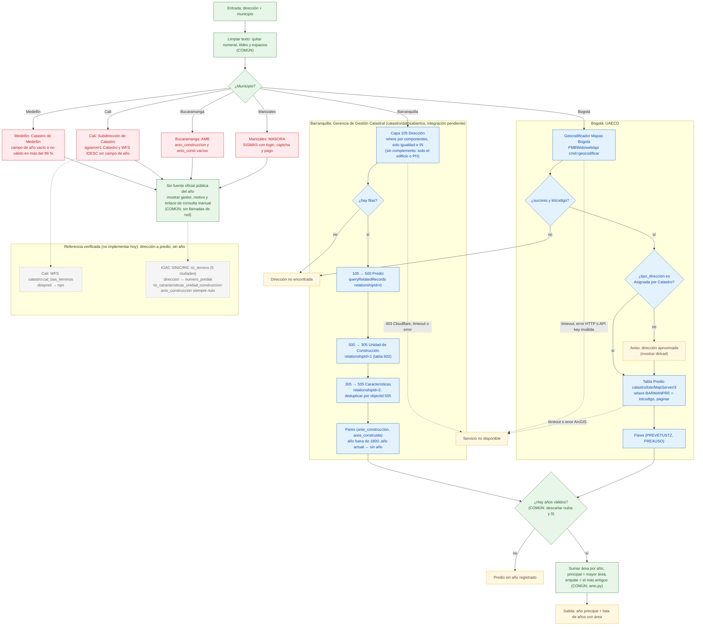

# Fuentes oficiales por municipio (año de construcción)

Investigación con peticiones reales el **2026-09-26** (curl / scripts Python cortos desde Bogotá,
IP residencial colombiana). Bogotá se verificó el 2026-09-25 (ver `FUENTES.md`). La sección de
Barranquilla se reescribió el mismo 2026-09-26, después de la Evaluación v2 (`EVALUACION.md`). Respuestas
crudas en `tests/fixtures/<ciudad>/` y `tests/fixtures/nacional/`.

## Conclusión en una línea

**Bogotá y Barranquilla publican el año de construcción en un servicio oficial abierto.** Barranquilla
lo publica en `miciudad.barranquilla.gov.co/.../catastro/datosabiertos/MapServer` (corregido el
2026-09-26, ver su sección). Ese servidor está detrás de Cloudflare, que bloqueó (403) algunas
consultas legítimas hechas con `requests`, así que integrarlo tiene un riesgo real de fallos. En Medellín,
Cali, Bucaramanga y Manizales el gestor catastral **no publica** el año (o publica el campo vacío).
Además, el reporte nacional del IGAC (SINIC/RIC), que sí tiene el campo `anio_construccion` para las
5 ciudades, lo trae **nulo en los 8.016.896 registros del país**. Esas 4 ciudades quedan como
**✘ sin fuente oficial pública** y la app debe decirlo sin inventar un año.

## Matriz resumen

| Ciudad | Gestor catastral vigente | Dirección → predio | Predio → año | Campo del año | Vigencia de los datos | Estado |
|---|---|---|---|---|---|---|
| **Bogotá** (referencia) | UAECD (gestor propio) | Geocodificador Mapas Bogotá `catalogopmb.catastrobogota.gov.co/PMBWeb/web/api` (clave pública del visor) | ArcGIS `catastro/lote/MapServer/3` (tabla Predio) | `PREVETUSTZ` = "Año de la construcción" (diccionario IDECA) | mensual (dataset 08.26) | ✔ verificado de punta a punta (2026-09-25) |
| **Medellín** | Catastro de Medellín, Subsecretaría de Catastro del Distrito (gestor propio) | ✔ buscador del geovisor MapGIS `servicios5/GEOCOD_WEB_MAPGIS9/geocodificador/service/geocod` (`dir` → `cbml`) | capas LADM/histórico y GP `info_uconst_cbml` por CBML | `anio_construccion`/`anioconstruccion`/`anio_const`: vacío o no válido en más del 99,9 % (máx. 641 de 236.284; valores 2025, 2024, 2021 y basura) | Historico 2021-2023; LADM 2025 | ✘ sin fuente pública utilizable (reverificado 2026-09-27) |
| **Cali** | Distrito de Santiago de Cali, Subdirección de Catastro (Hacienda) (gestor propio) | ✔ WFS IDESC `catastro:cat_bas_terrenos` (`direpred` → `npn`) | **ninguno** | no existe en `agserver1/Catastro/MapServer` (Terrenos, Construcciones, tabla alfanumérica), WFS, datos.cali ni RIC | terrenos 2025-09-02; tabla alfanumérica 2025-11-07 | ✘ sin fuente pública: el gestor no publica el año |
| **Barranquilla** | Distrito de Barranquilla, Gerencia de Gestión Catastral (gestor propio) | ✔ `miciudad.barranquilla.gov.co/.../catastro/datosabiertos/MapServer/105` (Dirección, por componentes) → relación a `500` Predio (NPN) | `500` → `305` Unidad de Construcción → `505` Características (`queryRelatedRecords`) | `anio_construccion` ("Año de construcción de la unidad de construcción", LADM_COL; con valor en 506.672 de 506.672; 2.418 fuera de rango y 1986 sospechoso, ver sección) | vigencia 2026-01-01 (473.907 de 478.361 predios); tabla 505 modificada 2026-06-02 | ✔ cadena verificada (2026-09-26) · ⚠ Cloudflare: curl siempre 403; `requests` 200 pero con 2 bloqueos 403 en ~50 consultas. Integración pendiente de decisión |
| **Bucaramanga** | Área Metropolitana de Bucaramanga (AMB), gestor habilitado por Res. IGAC 1267/2019, opera desde 2020-01-08 | R1 en datos.gov.co `3qja-8idc` (`direccion` → `numero_del_predio`, vigencia 2021) | **ninguno** | `anio_construccion` (GDB oficial) y `anio_const` (visor AMB): **nulo/0 en el 100 %** | R1/R2 vigencia 2021; GDB 2023-02; visor "Alturas" 2023 | ✘ sin fuente pública: el campo existe pero está vacío |
| **Manizales** | MASORA (Municipios Asociados del Altiplano del Oriente Antioqueño), gestor por contrato desde 2021-09-13 | RIC IGAC (`direccion` → `numero_predial`) | **ninguno** | RIC `anio_construccion` nulo; el sistema de MASORA (SISMAS) exige registro, login, captcha y pago | RIC 2025-06-18 | ✘ sin fuente pública: la única consulta del gestor exige login, captcha y pago |

Gestores confirmados con el dataset oficial del IGAC *Gestores Catastrales de Colombia*
(`https://www.datos.gov.co/resource/bhcx-bx97.json`, fixture `nacional/igac_gestores_catastrales_6_ciudades.json`).
Ninguna de las 5 ciudades es jurisdicción del IGAC, así que las bases abiertas del IGAC como gestor
no las cubren (verificado: 0 registros para 05001, 76001, 08001, 68001 y 17001).

---

## Fuentes nacionales (comunes a todas las ciudades)

### IGAC: Base Catastral SINIC (RIC). Tiene el campo del año, pero siempre vacío

- **URL:** `https://sigi.igac.gov.co/habilitacion/rest/services/sinic/ric/FeatureServer`
  (item ArcGIS `ff259c86455b48848363f6b02e3e84c8`, dueño `IGAC-Admin`, público, licencia "Sin
  limitaciones de uso"). Es el reporte bimestral de **todos** los gestores al SINIC en modelo LADM.
- **Capas:** `0 ric_terreno` (`municipio`, `numero_predial`, `direccion`, `nombre_gestor`,
  `vigencia_actualizacion`, `fecharegistro`…), `1 ric_construccion`,
  `2 ric_caracteristicas_unidad_construccion` (`numero_predial`, `identificador`, `anio_construccion`,
  `area_construccion`, `numero_pisos`…). SR **EPSG:9377** (MAGNA-SIRGAS Origen Nacional).
  `maxRecordCount` 100000.
- **Hallazgo clave:** `anio_construccion IS NOT NULL` → `{"count":0}` sobre 8.016.896 unidades
  (fixture `nacional/ric_unidad_construccion_conteo_con_anio.json`). En las 6 ciudades revisadas
  todos los terrenos tienen `fecharegistro = 2025-06-18`.
- Cobertura por ciudad en `ric_terreno`: Medellín 444.951, Cali 347.800, Barranquilla 188.896,
  Manizales 174.463, Bucaramanga 118.522. Unidades de construcción: Medellín 1.056.370,
  Barranquilla 278.268, Manizales 120.310, **Cali 0, Bucaramanga 0**.
- Calidad de `direccion` y `numero_predial` (muestras reales):
  Medellín `numero_predial=' '` y `direccion='CL  101 C  022 B 093 0141'` (con ceros de relleno y
  dobles espacios), o la dirección es una copia del CBML (`'03020100009'`). Cali y Bucaramanga tienen
  muchas direcciones vacías (`''`). Manizales tiene filas duplicadas.

```bash
curl -s -G "https://sigi.igac.gov.co/habilitacion/rest/services/sinic/ric/FeatureServer/2/query" \
  --data-urlencode "where=anio_construccion IS NOT NULL" \
  --data-urlencode "returnCountOnly=true" --data-urlencode "f=json"
# -> {"count":0}
```

**Uso posible:** es la única fuente que da dirección → número predial nacional (NPN) con el mismo
esquema para las 5 ciudades. Si el IGAC empezara a publicar `anio_construccion`, serviría como
adaptador común. Hoy **no sirve** para el objetivo.

### IGAC: Base Catastral Pública del Gestor IGAC 08-2026

`https://services2.arcgis.com/RVvWzU3lgJISqdke/arcgis/rest/services/CATASTRO_PUBLICO_31082026/FeatureServer`
(también en WFS y en datos.gov.co `3b89-627h`). Capas R1, R2, terreno, construcción y nomenclatura.
**No tiene campo de año** (R2 trae habitaciones, baños, pisos, uso, puntaje y área) y **no cubre**
ninguna de las 5 ciudades.

### datos.gov.co

Catálogo Socrata `https://api.us.socrata.com/api/catalog/v1?domains=www.datos.gov.co&q=...`.
No aparece ningún dataset con "vetustez" (0 resultados). Los datasets catastrales de las 5 ciudades
son R1/R2 o cartografía sin año (detalle por ciudad abajo).

---

## Medellín

- **Gestor:** Catastro de Medellín (Secretaría de Gestión y Control Territorial, Subsecretaría de
  Catastro). Gestor propio, "EN OPERACION" según IGAC.
- **Reverificado el 2026-09-27** (el 404 del 2026-09-26 fue temporal). Se exploró el geovisor
  MapGIS (`https://www.medellin.gov.co/mapgis9/mapa.jsp?aplicacion=1`) y los 301 servicios de su
  ArcGIS Server (`https://www.medellin.gov.co/servidormapas/rest/services`, versión 11.5), sin token.
- **Conclusión:** dirección → CBML funciona con el buscador oficial del visor, pero **ninguna fuente
  pública trae el año de construcción utilizable**. El campo existe en 8 capas y en un geoproceso,
  pero está vacío (0/nulo) en más del 99,9 % y los pocos valores son años de actualización (2025,
  2024, 2021) o basura (1, 3, 52, 400, 32767). Se mantiene "sin fuente oficial pública"; el motivo
  es "campo vacío", no "no existe".

### Cómo funciona el geovisor MapGIS

1. `mapa.jsp` abre una sesión anónima: `POST /mapgis_seg/validacionPublico.do` (`app=0&appPublic=1`
   → `1`), `POST /mapgis_seg/validacionToken.do` (`app=1` → JWT), `POST /mapgis9/inicioAjax.do`
   (parámetros, mapas base y catálogo de 300 capas separados por `|;|`). Usuario "Publico", sin login.
2. Las capas son servicios ArcGIS REST de `servidormapas`. Las catastrales del catálogo:
   `vivienda_ciudad_terri/VC_Catastro_VCT/MapServer/0..10` (Lote = 7, Construcción = 8, Uso = 9) y
   `mapas_nacionales/VC_Catastro/MapServer/0..4`. **Ninguna tiene campo de año.**
3. **Buscador de direcciones (paso 1, verificado):**
   `GET https://www.medellin.gov.co/servicios5/GEOCOD_WEB_MAPGIS9/geocodificador/service/geocod`
   con `dir=<dirección>` y `accion=11111111111`. Respuesta (lista JSON):
   `cbml` (11 dígitos), `x`/`y` (origen nacional), `p13` = latitud, `p12` = longitud, `p4` comuna,
   `p5` código de barrio, `p6` comuna (nombre), `p7` barrio, `p9` dirección normalizada, `tipo`
   (`"CATASTRO"`). Ej.: `CL 44 52 165` → `cbml=10100030004`. Sin resultado: `x == "0"`. Fixture:
   `medellin/mapgis_geocod_CL_44_52_165.json`.

### Dónde está el campo de año (2026-09-27)

| Fuente | Campo | Registros | Con año 1800..2026 | Valores |
|---|---|---|---|---|
| `ServiciosCatastro/ConsultaOperadorCatastral_geo/MapServer/18` (UConstruccion_LADM; igual a `ConsultaOperadorCatastral/11`) | `anio_construccion` | 236.284 | 641 | 2025 (541), 2024 (72), 2022 (21), 1990 (7); además 1, 2, 3, 4, 6, 29, 32767 |
| `ServiciosCatastro/ConsultaOperadorCatastral_geo/MapServer/21` (Construccion_LADM) | `anioconstruccion` | 307.140 | 0 | — |
| `vivienda_ciudad_terri/VA_ConsultaOperadorCatastral/MapServer/17` y `_geo/16` | `anioconstruccion` | 307.144 | 0 | — |
| `ServiciosCatastro/ide_catastro/MapServer/6` (Construcción Detallada) | `anioconstruccion` | 1.144.339 | 100 | 2021 |
| `ServiciosCatastro/HistoricoCatastral/MapServer/154` (Construccion_2023) | `anioconstruccion` | 1.160.211 | 137 | 2021; además 1, 52, 400 |
| `HistoricoCatastral/MapServer/16` (2022) y `/26` (2021) | `anioconstruccion` | 1.148.572 / 1.139.834 | 137 / 116 | — |
| GP `vivienda_ciudad_terri/infouconstlote/GPServer/info_uconst_cbml` (`id_cbml`) | `<anio_const>` (XML por unidad: `identificador`, `areas_privada`, `altura`…) | muestra de 39 lotes al azar + 04100190003 | 0 | siempre `0`; 38 de 39 lotes sin filas |

- Otros GP: `infouconstpredio/info_uconst_predio` (igual que el anterior, por `id_predio`),
  `ServiciosCatastro/infopredio/info_predio` (error de PostgreSQL), `FichaPredial` e
  `ImagenFichaIDE` (solo imágenes del plano y las plantas, sin datos).
- `VM_Licencias` (`anio` de la licencia de curaduría) y `VM_Oferta_Comercial_Oime` (`anio` de la
  investigación de mercado) no son el año de construcción.
- Fixture del GP: `medellin/gp_info_uconst_cbml_04100190003.json`.

### Otras fuentes revisadas (2026-09-26)

| Fuente | URL | Campos | ¿Año? |
|---|---|---|---|
| MEData "Información Predios" | `http://medata.gov.co/sites/default/files/distribution/1-014-26-000298/informacion_predios.csv` (92 MB, archivo 2025-03-26, datos 2021) | `CBML`, `Matricula`, `Estrato`, `UsoPredial`, `AvaluoTotal`… (diccionario en fixture `medellin/medata_informacion_predios_diccionario.json`) | no, y tampoco tiene dirección |
| MEData "Información Lotes" | `.../1-014-26-000297/informacion_lotes.csv` | `CBML`, `AreaLote`, `AreaCons`, `numPisos` | no |
| RIC IGAC | ver arriba | `anio_construccion` | nulo (fixture `medellin/ric_unidad_construccion_050010007500100000001000000000.json`) |

- **Identificador predial:** CBML (comuna-barrio-manzana-lote, 11 dígitos) o el NPN de 30 dígitos.
- **Camino manual (el único con el dato):** la "Ficha catastral del predio" y el "Certificado
  catastral" (`https://www.medellin.gov.co/es/tramites-y-servicios/ficha-catastral-predio/`, que
  lleva a `/irj/portal/medellin/certificados-catastro`) exigen usuario registrado en el portal. La
  ficha trae "EDAD DE LA CONSTRUCCIÓN (EN AÑOS)" (año ≈ año de la ficha − edad). Es un documento
  por predio con login: no se automatiza.

---

## Cali

- **Gestor:** Distrito de Santiago de Cali, Departamento Administrativo de Hacienda, Subdirección de
  Catastro Municipal. Gestor propio.
- **Nota de migración:** `geoportal.cali.gov.co` ya **no existe** (NXDOMAIN en DNS público). El
  geoportal catastral oficial está ahora en `arcgisportal.cali.gov.co`. `idesc.cali.gov.co`
  devuelve una página vacía.

### Dirección → predio (✔ verificado, sin año)

WFS GeoServer de la IDESC, capa `catastro:cat_bas_terrenos` (751.266 registros, `last_edite` 2025-09-02):

```bash
curl -s -G "https://ws-idesc.cali.gov.co/geoserver/ows" \
  --data-urlencode "service=WFS" --data-urlencode "version=2.0.0" --data-urlencode "request=GetFeature" \
  --data-urlencode "typeNames=catastro:cat_bas_terrenos" --data-urlencode "outputFormat=application/json" \
  --data-urlencode "propertyName=npn,direpred,numepred,id_predio,n_construc,total_pis1,area_cons1,uso_princi,last_edite" \
  --data-urlencode "CQL_FILTER=direpred = 'KR 100 # 11 A - 25'"
```

Respuesta real (`cali/wfs_terrenos_kr100_11a_25.json`):

```json
{"type":"FeatureCollection","features":[{"type":"Feature","id":"cat_bas_terrenos.224615","geometry":null,
 "properties":{"id_predio":511076,"npn":"760010100229800140156000000000","numepred":"F059901560000",
 "direpred":"KR 100 # 11 A - 25","last_edite":"2025-09-02Z","uso_princi":"COMERCIAL","n_construc":2,
 "total_pis1":1,"area_cons1":21}}],"numberMatched":1,"numberReturned":1,"crs":null}
```

No encontrado: `numberMatched: 0` (`cali/wfs_terrenos_no_encontrado.json`).
Formato de `direpred`: `KR 100 # 11 A - 25`, `KR 54 A # 47 OESTE - 11`, `K 90  # 48 B  - B 14T`
(con `#`, guiones, letras separadas y espacios irregulares; en PH se añade `LC 121`, `GA 83`…).
Buscar por dirección exige replicar ese formato o usar `LIKE`.

### Predio → año (✘)

Servicio del visor oficial "Geoportal Catastral – Subdirección de Catastro"
(`https://arcgisportal.cali.gov.co/arcgis/apps/webappviewer/index.html?id=673bc5d633e04ff888f451b5aa17d0a2`):
`https://arcgisportal.cali.gov.co/agserver1/rest/services/Catastro/MapServer`, SR wkid 102796 = EPSG:6249
(MAGNA-SIRGAS Cali), `maxRecordCount` 2000.

| Capa | Campos | ¿Año? |
|---|---|---|
| 0 Terrenos (356.701) | `IDTERRENO`, `NPN_TERRENO`, `ID_PREDIO`, `NUMEPRED`, `latitud`, `longitud`… | no |
| 3 Construcciones | `IDTERRENO`, `NPISOS`, `TIPO_CONS`, `U_DESTINOS`, `SIC_CONSTRUCCIONES_AREA`, `SE_ANNO_CAD_DATA` | no (`SE_ANNO_CAD_DATA` es un **Blob** de anotación CAD, siempre nulo; **no** es un año) |
| 4 BASE_ALFANUMERICA_20251107 (tabla) | `NPN`, `NUM_PREDIAL`, códigos de comuna/barrio/manzana | no |

Fixtures: `cali/terrenos_id_predio_511076.json`, `cali/construcciones_idterreno_00229800140156.json`
(339,4 m², sin año). También sin año: datos.cali.gov.co "Información de Predios 2024"
(NPN, destino, **vigencia de actualización**, áreas), "Información Histórica de Predios" (áreas y
avalúos por vigencia), `Hosted/Información_OIC/Terrenos_022026`. `Hosted/Inventario_Inmobiliario_OIC`
trae `edad_const`, pero **solo para ofertas del mercado**, no para el registro catastral de cada predio.
Las carpetas `Utilities` y `SIBICA` exigen token.

- **Camino manual:** abrir el Geoportal Catastral (enlace de arriba) → buscar/ubicar → clic en el
  terreno (NPN, pisos, áreas; sin año). El certificado catastral es un trámite presencial y pagado
  en el CAM, Av. 2 Norte (`https://www.cali.gov.co/hacienda/publicaciones/164112/como-tramitar-facil-y-rapido-su-certificado-catastral/`).

---

## Barranquilla

- **Gestor:** Distrito de Barranquilla, Secretaría de Hacienda, Gerencia de Gestión Catastral.
  Gestor propio.
- **Estado (2026-09-26, corregido después de la Evaluación v2):** **hay fuente oficial abierta con el
  año.** Es el servicio "Datos abiertos de Catastro Barranquilla" en el servidor propio de la Alcaldía,
  y la cadena dirección → predio → unidades de construcción → año quedó verificada con peticiones
  reales. **Riesgo:** el servidor está detrás de Cloudflare. `curl` recibe siempre 403 y `requests`
  recibió 403 en 2 de ~50 consultas, una de ellas simple y por igualdad (ver "Acceso y bloqueos").
  La investigación se detuvo en el segundo 403 sin reintentar. Quedan pendientes los casos de
  prueba y los fixtures nuevos.

### Por qué la investigación anterior no la encontró

1. `curl` (con su User-Agent por defecto) recibe **403 de Cloudflare** en `*.barranquilla.gov.co`.
   Eso se tomó como un bloqueo de todo el dominio y no se probó con `requests`, el cliente que usa la
   app. Con `requests`, este servidor responde 200.
2. El barrido de "1.343 servicios" recorrió el directorio de servicios alojados en ArcGIS Online de
   la Alcaldía (`services3.arcgis.com/oGYAc07w6wsvgUYr/arcgis/rest/services`). Ese directorio solo
   lista las capas *hosted* (`Catastro25`, `Mapa_Distrito…`, `LADM_COL_ESQUEMA`), que están vacías de
   año. El item público **"Catastro_Entidad"** de la misma organización
   (`154d5320cba74e6f8fdfbdde2ba309bd`, dueño `planeacion_territorial_baq`, snippet "Informacion
   oficial castasstro en linea 2026", tags "datos abiertos") apunta a un servicio del **servidor propio**
   `miciudad.barranquilla.gov.co`, y ese tipo de item no aparece en el directorio *hosted*. Lo encontró
   el Evaluador buscando por items de la organización.

### Fuente

- **URL base:** `https://miciudad.barranquilla.gov.co/gis/rest/services/catastro/datosabiertos/MapServer`
  (en adelante `{B}`).
- **Servicio:** ArcGIS Server 11.5, `mapName` "Barranquilla_Publico_gis", descripción "Datos abiertos
  de Catastro Barranquilla", copyright y `accessInformation` "Gerencia de Gestión Catastral".
  **Licencia CC BY 4.0** (`{B}/info/iteminfo`). Admite `Query,Map,Data`, `maxRecordCount` **2000**,
  formatos JSON/geoJSON/PBF, paginación, `returnDistinctValues`, `outStatistics` y
  `queryRelatedRecords` con paginación.
- **Modelo:** LADM_COL, *Modelo Extendido Catastro Registro* (clases `CR_*` y `LC_*`; las tablas
  llevan copyright "IGAC").
- **Sistema de coordenadas:** EPSG:9377 (MAGNA-SIRGAS 2018 Origen Nacional). ArcGIS admite `outSR`,
  pero aquí no se probó porque la app no necesita geometría (`returnGeometry=false`).
- **Vigencia:** `500.vigencia_actualizacion` = 2026-01-01 en 473.907 de 478.361 predios (4.443 nulos,
  el resto sueltos entre 2018 y 2026). Metadatos: el servicio es del 2026-01-26 y la tabla 505 se
  modificó el 2026-06-02 (`{B}/505/metadata`). Las 2.406 unidades con año 2026 están todas en los
  `objectid` más altos (499.224–506.609), así que hay cargas durante 2026.
- **Diccionario:** el servicio **no** publica definiciones de campos: `{B}/505/metadata` e
  `{B}/info/metadata` solo traen nombres y alias. La definición oficial está en el **Diccionario de
  Datos Modelo Extendido Catastro Registro LADM_COL v4.1** (IGAC–SNR, aprobado en agosto de 2024,
  p. 14, <https://www.icde.gov.co/sites/default/files/2024-09/Diccionario_de_Datos_Modelo_Extendido_Catastro_Registro_v4_1.pdf>):
  clase `CR_CaracteristicasUnidadConstruccion` ("Clase que permite agrupar las unidades de
  construcción por identificador, uso y tipología"):
  - `Anio_Construccion`: **"Año de construcción de la unidad de construcción."** Cardinalidad **1**
    (obligatorio), numérico **1512..2500**.
  - `Area_Construida`: "Área total construida en la unidad de construcción", en m².

  Como el campo es obligatorio, cada unidad tiene que llevar algún valor aunque no se conozca el año.
  Eso explicaría los valores en los límites del dominio (1512, 2500), aunque es una inferencia: no
  hay documento que lo diga.

### Capas y tablas que se usan

| id | Nombre | Tipo | Registros | Campos útiles |
|---|---|---|---|---|
| 105 | Dirección | puntos | 498.679 | `clase_via_principal`, `valor_via_principal`, `letra_via_principal`, `valor_via_generadora`, `letra_via_generadora`, `numero_predio`, `complemento`, `nombre_predio` (dirección completa en texto), `sector_ciudad`, `sector_predio`, `es_direccion_principal`, `estado_direccion`, `tipo_direccion`, `codigo_postal` (**contiene el NPN**, a pesar del alias "Código Postal"), `cr_predio_guid` |
| 500 | Predio | tabla | 478.361 | `numero_predial_nacional` (NPN, 30 dígitos), `condicion_predio` (NPH 174.680, PH_Unidad_Predial 220.151, PH_Matriz 10.763, Informal 71.816…), `destinacion_economica`, `vigencia_actualizacion`, `globalid` |
| 305 | Unidad de Construcción | polígonos | 591.633 | `etiqueta`, `planta_ubicacion`, `tipo_planta`, `globalid` |
| 505 | Caracteristicas Unidad de Construcción | tabla | 506.672 | **`anio_construccion`** (SmallInteger, alias "Año Construcción", dominio de rango [1512, 2500]), **`area_construida`** (m²), `identificador` (A, B…), `tipo_unidad_construccion` (Residencial, Comercial, Industrial, Institucional, Anexo), `uso`, `total_plantas` |
| 602 | CR_UnidadConstruccion_CR_Predio | tabla de relación | 584.924 | `cr_predio_guid`, `cr_unidadconstruccion_guid` |

### Cadena dirección → año (relaciones exactas)

| Paso | Desde | `relationshipId` | Nombre | Claves |
|---|---|---|---|---|
| 1 | 105 → 500 | **0** | `CR_Predio` | `105.cr_predio_guid` = `500.globalid` (uno a muchos) |
| 2 | 500 → 305 | **1** | `CR_UnidadConstruccion` | muchos a muchos por la tabla 602 (`cr_predio_guid`, `cr_unidadconstruccion_guid`) |
| 3 | 305 → 505 | **2** | `CR_CaracteristicasUnidadConstruccion` | `305.cr_caracteristicasunidad_guid` = `505.globalid`. Ese campo **no se publica** en 305, así que el paso solo se puede hacer con `queryRelatedRecords` |

Las relaciones inversas son 500 → 105 (id 0, "Dirección"), 305 → 500 (id 1) y 505 → 305 (id 2,
"CR_UnidadConstruccion"). Una misma fila 505 puede estar ligada a **varias** unidades 305 (hay
591.633 unidades para 506.672 características). Por eso hay que **deduplicar las filas 505 por
`objectid`** antes de sumar áreas. Si no, una unidad con varias plantas o compartida en PH suma su
área dos veces. La misma deduplicación aplica entre predios de un mismo PH.

Peticiones (4 por dirección, todas con `f=json` y `returnGeometry=false`):

```
GET {B}/105/query                 where=<componentes por igualdad>  outFields=objectid,nombre_predio,codigo_postal,cr_predio_guid
GET {B}/105/queryRelatedRecords   objectIds=<objectid 105>  relationshipId=0  outFields=objectid,numero_predial_nacional,condicion_predio
GET {B}/500/queryRelatedRecords   objectIds=<objectid 500>  relationshipId=1  outFields=objectid,etiqueta
GET {B}/305/queryRelatedRecords   objectIds=<objectid 305>  relationshipId=2  outFields=objectid,anio_construccion,area_construida,identificador,uso
```

`queryRelatedRecords` acepta varios `objectIds` separados por coma y devuelve `relatedRecordGroups`
agrupados por el `objectId` de origen. Cada respuesta trae como máximo 2.000 registros, así que en un
PH grande hay que partir los `objectIds` en lotes (en la verificación se usaron lotes de 100 a 150,
sin problemas).

**Ejemplo real** (evidencia del Evaluador, `eval_baq_evidencia.json`): "Carrera 55 48 26"
- **105:** `objectid` 37109, `nombre_predio` 'Carrera 55 48 26', `codigo_postal` 080010101000002110002000000000,
  `cr_predio_guid` {7845EC54-CB7E-4427-968E-9CC3BD5D208F}.
- **500:** `objectid` 5653, NPH, Habitacional, vigencia 2026-01-01.
- **305:** unidades 403966 (A) y 403967 (B).
- **505:** A = **2001**, 227 m², `Residencial_Vivienda_Hasta_3_Pisos`; B = 1981, 2 m², `Anexo_Ramadas_Cobertizos_Caneyes`.
- **Año por la regla de `anio.py`:** **2001** (desglose 2001: 227 m², 1981: 2 m²).
- **Contraste:** `Catastro25` da para el mismo NPN 126 + 2 m² con `anio_const` 0. Las áreas tampoco
  coinciden entre los dos productos.

### Formato de dirección (capa 105)

- `nombre_predio` es el texto completo, sin `#` ni guion:
  - letras separadas por espacio: `Calle 29 B 24 2`, `Calle 16 26 B 1`;
  - "Sur" dentro del texto: `Carrera 1 Sur 48 3` (con `sector_ciudad='Sur'`, 13.721 filas) y
    `Calle 76 1 Sur 02` (con `sector_predio='Sur'`, 12.932 filas);
  - complemento al final: `Calle 66 43 12 PI 2 AP 202`, `VIV 4`, `LT 2`, `IN 1`.
- `clase_via_principal`: Carrera 252.124, Calle 229.972, Transversal 8.694, Diagonal 6.950, Via 910,
  Circunvalar 22, Circular 3, Avenida 3, Avenida_Carrera 1.
- `numero_predio` es **texto**. Las placas de un dígito aparecen con cero a la izquierda (`'03'`,
  18.065 filas) y también sin él (`'3'`). Hay 643 valores distintos, algunos no numéricos (`'66A'`,
  `'11 A'`, `'MZ R | LT 13'`).
- Las letras vienen con variantes: `B`, `B1`, `F 1`, `'B '` con espacio sobrante (437), `'SUR'`
  (418 en `letra_via_principal`). "BIS" casi no existe (17 filas).
- 5.616 filas tienen los componentes en `'0'` aunque `nombre_predio` trae la dirección (p. ej.
  `Calle 122 25 6`). Una búsqueda por componentes no las encuentra.
- `tipo_direccion`: Estructurada 495.964, No_Estructurada 2.715 (`SIN DIRECCION`, `LOTE DE TERRENO`).
  `estado_direccion`: 1 = 494.615, 2 = 4.064. `es_direccion_principal`: 1 = 480.005, 0 = 18.674.
- **Una dirección puede dar varios predios.** Puede ser el terreno más una mejora (NPN con `5` en la
  posición 22: `Calle 16 26 B 1`, `Via 17 7 19`, `Calle 13 10 01`). En PH hay una fila por unidad,
  con su complemento (`AP 101`…).
- **Recomendación:** buscar por **componentes con igualdad** (`clase_via_principal`,
  `valor_via_principal`, `letra_via_principal`, `valor_via_generadora`, `letra_via_generadora`,
  `numero_predio`), **sin** `complemento`, para reunir todo el edificio o PH y agregar como Bogotá
  por lote. Otras reglas:
  - Para la placa de un dígito, usar `numero_predio IN ('3','03')`.
  - Si el usuario no escribe letra, poner `letra_… IS NULL` para no mezclar `Calle 29 24 2` con
    `Calle 29 B 24 2`.
  - Si escribe "Sur", agregar `sector_ciudad='Sur'` o `sector_predio='Sur'` según a qué vía siga.
  - **No usar `LIKE`, `OR` ni comodines** (ver bloqueos).

  La alternativa `nombre_predio = '<texto exacto>'` solo encuentra las filas sin complemento.

### Calidad del año (`505.anio_construccion`)

Distribución completa (`outStatistics` agrupado por año, 2026-09-26; fixture pendiente, copia en el
scratchpad de la sesión `baq/dist_anio_505.json`). 506.672 filas, 105 valores distintos, ninguna nula:

| Grupo | Filas | % |
|---|---|---|
| Fuera de rango: 1512 (límite inferior del dominio) | 222 | 0,04 |
| Fuera de rango: 2500 (límite superior del dominio) | 2.195 | 0,43 |
| Fuera de rango: 20 | 1 | 0,00 |
| Entre 1900 y 2026 (no hay ninguno entre 21 y 1899 salvo 1512) | 504.254 | 99,52 |
| de ellos, 1980–2026 | 482.176 | 95,17 |
| **1986** | **50.093** | **9,89** |
| 1987 | 18.829 | 3,72 |

- **Picos que no parecen reales:** 1986 tiene 22 veces el promedio de sus vecinos (1983–1985 y
  1988–1990 promedian 2.211). Otros picos: 1942 (6.185), 1952 (3.264), 1962 (1.847), 1970 (2.407),
  1972 (1.628) y 1932 (196), contra vecinos de 1 a 30 filas. Estos últimos están concentrados en
  `objectid` altos (media ~445.000–471.000, es decir, cargas recientes), tienen un área media baja
  (44–50 m² contra 99 m² global) y parecen años redondeados a partir de una edad estimada. También hay picos en 1996 (16.357), 2010 (33.466), 2014 (42.788) y
  2022 (30.203), que podrían coincidir con procesos masivos de actualización. Esto no se pudo
  comprobar.
- **Análisis de 1986** (estadísticas del servicio):
  - Está repartido en **todo** el rango de `objectid` (69–506.649, media 208.364; la media global
    ronda 253.000), así que no viene de una carga aislada.
  - Casi no incluye anexos: 487 de 50.093 (1,0 %), frente a 61.225 de 506.672 (12,1 %) en total. Es
    sobre todo construcción principal: Residencial 83,5 % (global 75,8 %) y Comercial 12,2 %
    (global 9,7 %). Usos principales: `Residencial_Vivienda_Hasta_3_Pisos` 29.649 y
    `Residencial_Apartamentos_4_y_mas_pisos_en_PH` 6.547.
  - Área media 107,9 m² (global 99,1).
  - `estado_conservacion` = "Sin información" en el 99,4 % (97,0 % global), así que ese campo no
    distingue nada.
  - No hay otra fuente que lo confirme o lo desmienta (ver "Contraste").
  - **Conclusión:** un 9,9 % de todas las unidades en un solo año no es creíble como historia
    constructiva real. Lo más probable es que 1986 sea un valor asignado cuando no se conocía el año
    (el campo es obligatorio), por ejemplo el de un proceso catastral antiguo, pero **ningún
    documento oficial lo confirma**. Queda como duda documentada: no se descarta, y conviene avisar.
- **Regla recomendada de filtrado:**
  - Año válido = **1800 ≤ año ≤ año actual**. Así se descartan 1512, 2500 y 20 (2.418 filas, 0,48 %).
    El límite superior va al año actual porque ya hay 2.406 unidades con 2026.
  - Los años fuera de rango se tratan como "sin año" (equivalen a nulo para `anio.py`).
  - **1986 se muestra**, pero la UI debería avisar, por ejemplo: "En el catastro de Barranquilla el
    año 1986 aparece en cerca del 10 % de las construcciones; podría ser un valor asignado y no el año
    real." La decisión es del Arquitecto o del usuario.
  - La regla del año principal no cambia: mayor suma de área por año; en empate, el más antiguo.

### Contraste independiente (✘: no hay una segunda vía que confirme)

- **`Catastro25/FeatureServer/1`** (ArcGIS Online, `anio_const` > 0 en solo 340 filas): son 147 NPN.
  64 de ellos están en `500`, y en 48 los dos productos tienen año. **Coinciden 3 y difieren 45.**
  Ejemplos:
  - `080010102000001310032000000000`: 1970 contra 1996;
  - `080010108000000530031000000000`: 1962 contra 1987;
  - `080010108000003710001000000000`: 2002 contra 2002.

  Los valores de `Catastro25` se concentran en 2024 (126), 2022 (78) y 2000 (55), que parecen fechas
  de trámite más que años de construcción. Los dos productos son del mismo gestor y no concuerdan, así
  que ninguno sirve para validar al otro.
- **IGAC RIC:** `anio_construccion` nulo en todo el país. **`Mapa_Distrito_de_Barranquilla_WFL1/3`:**
  `Anio_Construccion` > 0 en 0 filas.
- **Conclusión:** la "verdad" de los casos de prueba de Barranquilla tiene que venir de la **misma
  fuente** (`datosabiertos`). `evaluar.py` medirá entonces que el adaptador lee bien la fuente, no
  que el año sea correcto en la realidad.

### Acceso y bloqueos (Cloudflare / WAF). Riesgo alto

- **`curl`** con su User-Agent por defecto: **403 siempre** (página "Sorry, you have been blocked").
- **`requests`** con su User-Agent por defecto (`python-requests/2.34.2`): 200 en ~50 peticiones el
  2026-09-26, pero **403 en 2**:
  1. `105/query` con `where=nombre_predio LIKE '%BIS%' OR letra_via_principal LIKE '%BIS%' OR …`
     (patrón parecido a una inyección SQL).
  2. `105/query` con `where=clase_via_principal='Carrera' AND letra_via_principal='B' AND
     es_direccion_principal=1 AND objectid >= 60000 AND objectid < 90000`. Es una **consulta simple
     por igualdad y rango**, la número 24 de una tanda de 4 minutos con pausas de ~1,2 s. Justo antes
     había pasado `clase_via_principal='Calle' AND es_direccion_principal=1 AND estado_direccion=1
     AND objectid >= 20000 AND objectid < 20300`. También habían pasado `numero_predial_nacional IN
     (…100 valores…)` y la consulta del Evaluador por componentes de "Carrera 55 48 26".
- **No se reintentó** ni se cambió el User-Agent. No se sabe si el bloqueo depende del contenido de
  la consulta, del volumen de peticiones o de un puntaje de bots.
- **Implicaciones si se integra:**
  - La app puede recibir 403 en consultas legítimas.
  - Usar solo consultas simples por igualdad (e `IN`), nunca `LIKE`, `OR` ni comodines.
  - Hacer 4 peticiones por dirección, sin barridos.
  - Tratar el 403 como "Servicio no disponible" (`raise_for_status` → `RequestException`) y no
    reintentar en bucle.
  - No falsificar el User-Agent.
  - En `evaluar.py`, espaciar los casos.
  - Tener presente que el servicio puede dejar de responder a clientes automáticos sin aviso.

### Otras fuentes de la Alcaldía (sin año utilizable)

- **Dirección → NPN en ArcGIS Online** (no hace falta si se usa `datosabiertos`):
  `https://services3.arcgis.com/oGYAc07w6wsvgUYr/arcgis/rest/services/Direccion/FeatureServer/0`
  (471.476 puntos, editada 2026-09-11, `Direccion` 'Carrera 55 48 26' → `Codigo_1` = NPN).
- **`Catastro25/FeatureServer/1`** (Construcciones_0125, cargado 2026-01-29): `anio_const` = 0 en
  290.842 de 291.182. Los 340 valores restantes no concuerdan con `datosabiertos` (ver arriba).
  `Mapa_Distrito_de_Barranquilla_WFL1/3` y `LADM_COL_ESQUEMA` no tienen año.
- **Fixtures de la investigación anterior** en `tests/fixtures/barranquilla/`
  (`catastro25_construcciones_080010101000002110002000000000.json`,
  `catastro25_distribucion_anio_const.json`, `direccion_carrera_55_48_26.json`): se conservan, pero
  quedan **obsoletos** como evidencia del año. Documentan la conclusión "sin fuente", que ya no vale.
  Los fixtures de `datosabiertos` están **pendientes**: la investigación se detuvo por el 403 antes de
  capturarlos.

- **Camino manual:** `https://catastro.barranquilla.gov.co/identifica-tu-predio/` (buscar por
  dirección, referencia catastral o matrícula) y "Catastro Virtual"
  (`https://barranquilla.gov.co/hacienda/catastro/catastro-virtual`, con registro de usuario;
  certificados y fichas gratuitos). Esas páginas también responden 403 a clientes automáticos, así
  que no se pudo ver qué muestran.

---

## Bucaramanga

- **Gestor:** Área Metropolitana de Bucaramanga (AMB), habilitado por el IGAC (Res. 1267 del
  10/10/2019) y operando desde 2020-01-08. El AMB también es gestor de Girón y Piedecuesta.

### Dirección → predio (datos 2021, sin año)

R1 en datos.gov.co, "Registros 1 Municipio de Bucaramanga" (`3qja-8idc`, vigencia 2021, publicado
2022-01-14). Campos: `numero_del_predio` (15 dígitos, formato IGAC anterior, sin depto/mpio),
`direccion`, `destino_economico`, `area_terreno`, `area_construida`.

```bash
curl -s -G "https://www.datos.gov.co/resource/3qja-8idc.json" \
  --data-urlencode "\$where=direccion like 'CL 36 17 37%'" --data-urlencode "\$limit=5"
# -> [{"departamento":"68","municipio":"1","numero_del_predio":"010101030016901",
#      "direccion":"CL 36 17 37 OFC 202","destino_economico":"C","area_terreno":"4","area_construida":"30"}, ...]
```

R2 (`mjv3-q3v6`): habitaciones, baños, locales, pisos, tipificación, uso, puntaje y área construida.
**Sin año.**

### Predio → año (✘: el campo existe pero está vacío)

- GDB oficial "23 Cartografía Urbana Catastral… Municipio de Bucaramanga" (datos.gov.co `f4hz-53x5`,
  `BUCARAMANGA_M001_URBANO.gdb`, 2023-02): `u_lc_construccion.anio_construccion` nulo en las
  117.377 construcciones y `u_lc_unidadconstruccion.anio_construccion` nulo en las 212.830 unidades
  (verificado leyendo la GDB completa con `pyogrio`).
- ArcGIS Server del AMB `https://mapa.amb.gov.co/server/rest/services/VISOR/Alturas_Registradas/MapServer/0`
  ("Alturas Registradas - AMB (2023)", 230.635 polígonos): `anio_const>0` → `{"count":0}`
  (fixture `bucaramanga/amb_alturas_registradas_conteo_anio_const.json`). Otros servicios del
  VISOR (avalúos, estratificación, mutaciones) no tienen año. Las carpetas `EDITING`, `DASHBOARD` y
  `FORMULARIOS` exigen token.
- El RIC no tiene unidades de construcción de Bucaramanga (fixture
  `bucaramanga/ric_unidad_construccion_bucaramanga_vacio.json`).

- **Camino manual:** `https://www.amb.gov.co/consultas-catastro/` → "Consulte su predio – Visor
  catastral" → `https://visor.amb.gov.co/visor/`. El mapa web del visor (item
  `5c4aada1e6104505966287fcf8501f33` en `mapa.amb.gov.co/arcgis`) responde **403 sin sesión**, es
  decir, pide login. Datos abiertos: `https://www.amb.gov.co/datos-abiertos-catastro/`.

---

## Manizales

- **Gestor:** MASORA (asociación de municipios del Oriente Antioqueño), contratada por el municipio
  desde 2021-09-13 (dato del IGAC: `gestor_con = "CONTRATO"`).
- **Sistema del gestor:** "Portal Sismas" en `https://catastro.masora.gov.co` (app React; backend
  `geogestionApiRestLBMasora`). El código publicado muestra rutas `auth/login`, `auth/register`,
  `verify-email`, captcha **Cloudflare Turnstile**, pago **Wompi** (`/payment/wompi`, `/orders`) y
  consulta limitada a los predios del propio usuario (`/cadastral/{env}/userBaunits`). Todo exige
  registro, login, captcha o pago, así que **no se usa**.
- **Geoportal de la Alcaldía** (`https://geodata-manizales-sigalcmzl.opendata.arcgis.com`, org ArcGIS
  "Alcaldía de Manizales" `PtpS85InlUyG2Gqs`, 289 servicios revisados): POT, amenazas, plusvalía,
  manzanas DANE. **No hay capas de predios o construcciones con año.**
- `sig.manizales.gov.co` no tiene directorio REST (404).
- **Dirección → predio (solo RIC):** `ric_terreno` con `direccion='C 63 12A 31'` →
  `numero_predial 170010101000000730012000000000` (la fila viene **duplicada**; fixture
  `manizales/ric_terreno_c_63_12a_31.json`). Sus dos unidades de construcción (36,6 y 79,9 m²)
  tienen `anio_construccion: null` (`manizales/ric_unidad_construccion_170010101000000730012000000000.json`).
- **Camino manual:** registrarse en `https://catastro.masora.gov.co` y solicitar el
  certificado/ficha (con pago), o ir a la oficina de MASORA en Manizales
  (`https://masora.gov.co/gestion-catastral-manizales/`).

---

## Diagrama de flujo (integración)

Verde = pasos **comunes** a todas las ciudades. Azul = pasos **específicos** de una ciudad.
Rojo = ciudad sin fuente. Punteado = referencia verificada que **no** se implementa hoy.
La ruta de Barranquilla está verificada, pero su integración espera una decisión por el riesgo de
Cloudflare. Mientras no exista `municipios/barranquilla.py`, la app la sigue mostrando como "sin fuente".



### Lectura del diagrama para Arquitecto y Programador

- **Comunes:** limpieza de la entrada, agregación del año (hoy `anio.py`, que ya implementa "mayor
  área gana, empate el más antiguo"), los mensajes de salida y la rama "sin fuente oficial pública".
- **Específicos:** Bogotá tiene dos pasos de red (dirección→lote y lote→registros). Barranquilla
  tendría cuatro (105 → 500 → 305 → 505), todos por igualdad o `queryRelatedRecords`. Su adaptador
  debe convertir en "sin año" los años fuera de 1800..año actual (1512 y 2500 son límites del
  dominio), deduplicar las filas 505 por `objectid` y, si se decide, marcar el caso 1986 para que la
  UI avise (ver la sección de Barranquilla).
- **Propuesta mínima:** un registro de municipios con, para cada uno, `estado`
  (`"disponible"` / `"sin_fuente"`), `gestor`, `motivo` y `enlace_manual`. Bogotá usa los módulos
  actuales. Las ciudades sin fuente muestran el mensaje **sin llamar a ningún servicio**: no hay nada
  que consultar y así no aparecen falsos "servicio no disponible".
- **Para no reescribir más adelante:** que el paso de agregación reciba pares `(anio, area)` en vez
  de filas con `PREVETUSTZ`/`PREAUSO`. Así una ciudad futura solo necesita un adaptador que
  convierta sus filas a esos pares (ver la tabla siguiente).
- **No implementar** las rutas punteadas: dan dirección→predio pero ningún año, así que agregan
  llamadas de red sin resultado útil (restricción de alcance mínimo).

## Cómo elegir el año si un predio tiene varias construcciones

La regla de Bogotá (mayor suma de área por año, empate = el más antiguo, listar el resto) se puede
aplicar igual en todas las ciudades **si algún día publican el año**, porque todas las estructuras
revisadas traen un área por construcción:

| Ciudad | Filas | Campo de año (si se llena) | Peso (área) | Regla recomendada |
|---|---|---|---|---|
| Bogotá | Predio × unidad × uso | `PREVETUSTZ` | `PREAUSO` | vigente (`anio.py`) |
| Medellín | Construcción por CBML | (no existe hoy) | `area_construida` | igual que Bogotá |
| Cali | Construcciones por `IDTERRENO` | (no existe hoy) | `SIC_CONSTRUCCIONES_AREA` | igual que Bogotá |
| Barranquilla | `505` Características por unidad (vía 105 → 500 → 305), deduplicadas por `objectid` | `anio_construccion` (**publicado**) | `area_construida` | igual que Bogotá; **años fuera de 1800..año actual = sin dato** (1512, 2500, 20); incluir anexos como hace Bogotá con todos los usos; 1986 con aviso |
| Bucaramanga | `u_lc_unidadconstruccion` (LADM) | `anio_construccion` | `area_privada_construida` o área del polígono | igual que Bogotá |
| Manizales / cualquiera vía RIC | `ric_caracteristicas_unidad_construccion` por `numero_predial` | `anio_construccion` | `area_construccion` | igual que Bogotá; deduplicar filas idénticas antes de sumar |

Con la regla uniforme la app se comporta igual en todas las ciudades y una ampliación pequeña y
reciente no desplaza el año del edificio.

## Casos de referencia (sin año) para probar la rama "sin fuente"

Todos verificados el 2026-09-26. **No** se agregaron a `casos_prueba.csv` porque ahí cada fila
necesita un `anio_esperado` numérico (`evaluar.py` hace `int(fila["anio_esperado"])`).
Barranquilla salió de esta tabla: "Carrera 55 # 48-26" da **2001** en `catastro/datosabiertos`
(unidad A 2001 con 227 m² y unidad B 1981 con 2 m²). Sus casos para `casos_prueba.csv` están
pendientes.

| Municipio | Dirección digitada | Identificador oficial obtenido | Resultado esperado en la app |
|---|---|---|---|
| Cali | Carrera 100 # 11A-25 | `npn` 760010100229800140156000000000, `id_predio` 511076 (WFS) | sin fuente oficial pública |
| Bucaramanga | Calle 36 # 17-37 Oficina 202 | `numero_del_predio` 010101030016901 (R1 2021) | sin fuente oficial pública |
| Manizales | Calle 63 # 12A-31 (RIC: `C 63 12A 31`) | `numero_predial` 170010101000000730012000000000 (RIC) | sin fuente oficial pública |
| Medellín | cualquiera | (campo de año vacío o no válido en más del 99 %) | sin fuente oficial pública |

## Riesgos

- **Bogotá:** la `apikey` del geocodificador es la clave pública incrustada en el visor
  (ver `FUENTES.md`) y puede rotar sin aviso.
- **Datos desactualizados:** el RIC es una foto del 2025-06-18. Bucaramanga R1/R2 son de 2021 y su
  GDB de 2023-02. MEData de Medellín es de 2021. Cali está en 2025. Barranquilla (`catastro/datosabiertos`)
  tiene vigencia 2026-01-01 y cargas durante 2026.
- **Portales que cambian o fallan:** Medellín respondió 404 en todo su dominio durante parte del
  2026-09-26 y volvió más tarde. Cali migró de `geoportal.cali.gov.co` (ya no resuelve) a
  `arcgisportal.cali.gov.co/agserver1`. Las capas "hosted" de Barranquilla en ArcGIS Online tienen
  nombres por año (`Catastro25`, `Construcciones_0125`). La fuente con año de Barranquilla
  (`catastro/datosabiertos`) es un servicio del servidor propio de la Alcaldía; sus `id` de capa
  (105, 500, 305, 505) y de relación (0, 1, 2) pueden cambiar si republican el mapa.
- **Bloqueos:** MASORA (Turnstile, login, pago). **Barranquilla (Cloudflare):** `curl` recibe 403
  siempre. Con `requests` responde 200, pero el WAF bloqueó 2 de ~50 consultas: una con `LIKE`/`OR`
  y otra simple por igualdad (`letra_via_principal='B' AND …`). No se sabe qué regla la dispara. La
  app debe usar solo consultas simples por igualdad o `IN`, pocas peticiones, 403 = "Servicio no
  disponible" y sin reintentos en bucle. Nada de esto se evade: no se cambia el User-Agent.
- **Formatos de dirección muy distintos entre ciudades:** Barranquilla `Carrera 55 48 26` (palabras,
  sin `#`; en `datosabiertos` por componentes, con placas `'03'`/`'3'` y letras como `'B '` o `'F 1'`); Cali `KR 100 # 11 A - 25` (con `#`, guiones y espacios irregulares); Bucaramanga R1
  `CL 36 17 37 OFC 202`; Manizales RIC `C 63 12A 31`; Medellín RIC `CL  101 C  022 B 093 0141`
  (relleno con ceros). Un normalizador único no serviría para todas; cada ciudad necesitaría el suyo.
- **Sistemas de coordenadas:** EPSG:9377 (RIC, Barranquilla, AMB), EPSG:6249 (Cali agserver1),
  WGS84/4326 con `outSR` o campos `latitud`/`longitud`.
- **Campos engañosos:** Cali `SE_ANNO_CAD_DATA` (blob CAD, no es un año); Barranquilla `VIGENCIA`
  y Cali "Vigencia Actualización" (vigencias de avalúo); Barranquilla `105.codigo_postal`, que en
  realidad guarda el NPN; Barranquilla `anio_construccion` = 1512/2500 (límites del dominio, no
  años) y el pico de 1986 (posible valor por defecto); `edad_const` de Cali OIC (solo ofertas del
  mercado). Ninguno es el año de construcción del predio.

## Qué reverificar y cuándo

1. Medellín (reverificado 2026-09-27): repetir los conteos de la tabla "Dónde está el campo de
   año" (`anio_construccion`/`anioconstruccion` entre 1800 y el año actual). Si alguna capa se
   llena, el paso 1 ya existe (buscador MapGIS → `cbml`).
2. RIC IGAC (se reporta cada dos meses): repetir `anio_construccion IS NOT NULL` → count. Si deja
   de ser 0, el RIC serviría como fuente común para las 5 ciudades.
3. Barranquilla (`catastro/datosabiertos`):
   - si el WAF sigue bloqueando consultas simples con `requests` (probar una sola consulta por
     igualdad, sin reintentos);
   - que no hayan cambiado los `id` de capa y de relación (105/500/305/505 y 0/1/2) ni el dominio
     de `anio_construccion`;
   - la proporción de 1986 y de 1512/2500 (`outStatistics` agrupado por `anio_construccion`), y
     preguntar a la Gerencia de Gestión Catastral qué significa 1986;
   - si aparece un diccionario de datos propio del servicio.
