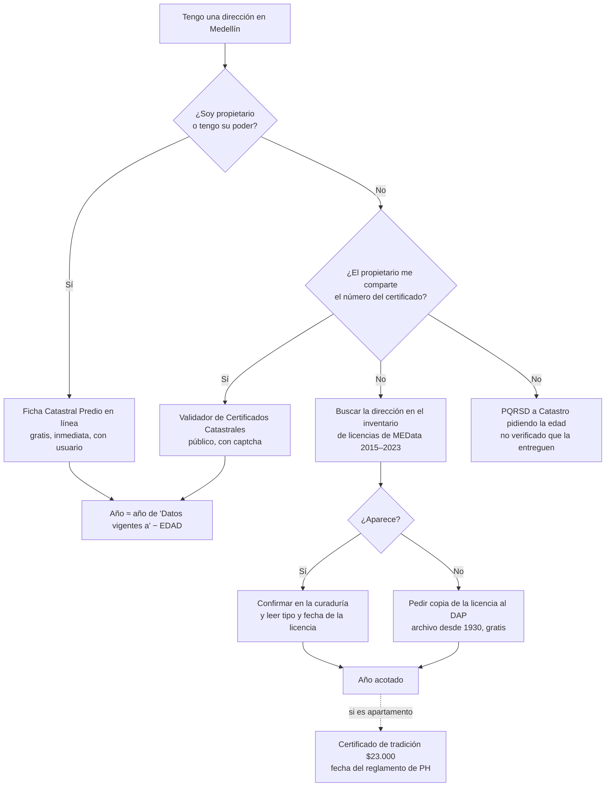

# Medellín: cómo averiguar el año de construcción de un inmueble a partir de su dirección

Guía para una **persona**, no para la app. Investigación del **2026-09-27**, hecha por tres agentes
en paralelo: (A) trámites del Catastro de Medellín, (B) geoportales y datos abiertos, y (C) vías
indirectas y portales no oficiales. Nadie creó cuentas, inició sesión, pagó ni se saltó bloqueos. Lo
que está detrás de un login se describe con la documentación oficial y se marca así.

Marcas: **[V]** verificado (lo vimos o lo consultamos) · **[D]** según documentación oficial ·
**[NO OFICIAL]** fuente privada, útil solo como pista.

---

## Respuesta corta

1. **No existe en Medellín una consulta pública y abierta que vaya de la dirección al año.**
   Ningún geoportal ni portal de datos abiertos muestra un año utilizable **[V]**.
2. **El dato oficial existe en la _Ficha Catastral Predio_**, en el campo
   **"EDAD DE LA CONSTRUCCIÓN (EN AÑOS)"** **[V]**. En línea es gratis e inmediata, pero pide usuario
   y, según el manual oficial, solo lista **los predios del propio usuario** **[D]**.
3. **Si no es el propietario,** hay vías oficiales que **acotan** el año: licencias urbanísticas
   (datos abiertos, curadurías y archivo del DAP desde 1930), el certificado de tradición y libertad y
   la escritura de propiedad horizontal.
4. **Los portales inmobiliarios** dan rangos de antigüedad declarados por el anunciante. Sirven solo
   como pista.

## ¿Qué camino le sirve?

---

## Tabla de plataformas

| # | Plataforma | Entidad | ¿Oficial? | Acceso y costo | ¿Acepta la dirección? | ¿Da el año? |
|---|---|---|---|---|---|---|
| 1 | **Ficha Catastral Predio** (portal web) | Subsecretaría de Catastro | Sí | Usuario, gratis, inmediata; solo predios propios [D] | No: el propietario elige de su lista | **Sí**: edad de la construcción [V] |
| 2 | Ficha Catastral Predio (taquilla, con cita) | Subsecretaría de Catastro | Sí | $8.114; propietario, poseedor o apoderado [V] | **Sí** (formulario FO-GCAT-037) [V] | **Sí** (misma ficha) |
| 3 | Validador de Certificados Catastrales | Subsecretaría de Catastro | Sí | Público, sin usuario, con captcha [V] | No: número de certificado de 15 dígitos | Sí, si alguien comparte una ficha vigente |
| 4 | PQRSD (derecho de petición) | Alcaldía | Sí | Gratis, cualquier persona [V] | Sí | No verificado que entreguen la edad a terceros |
| 5 | **Inventario de Licencias Urbanísticas** (MEData) | Planeación (DAP) | Sí | Libre, gratis, CSV [V] | **Sí** (buscando en el archivo) | Acota: fecha y tipo de licencia, 2015–2023 [V] |
| 6 | Consulta de resoluciones de las Curadurías 2ª, 3ª y 4ª | Curadurías urbanas | Sí (función pública) | Libre, gratis [V] | No: resolución + año (2016+) o radicado | Confirma la fecha de la licencia [V] |
| 7 | **Copia de licencias del archivo del DAP** | Planeación (DAP) | Sí | Gratis, videollamada o PQRSD [D] | Sí (se pide a un asesor) | Acota; en reconocimientos trae declaración de antigüedad [D] |
| 8 | Autorización de ocupación (MEData) | Control Urbanístico | Sí | Libre, gratis [V] | Sí | Fecha de recibo de obra, solo 125 proyectos (2015–2019) [V] |
| 9 | Certificado de tradición y libertad | SNR | Sí | Cuenta + $23.000 por PSE [V] | No: matrícula inmobiliaria | Acota: apertura del folio y anotaciones 0317/0911/0979 [V/D] |
| 10 | Copia de la escritura (reglamento PH o declaración de construcción) | Notaría | Sí | Tarifa notarial [D] | No: número de escritura | Acota; protocoliza la licencia [D] |
| 11 | SNR, módulo "Licencias urbanísticas" | SNR | Sí | Libre, gratis [V] | No: radicado | Fecha del acto, solo desde 13-07-2017 [V] |
| 12 | Mapas Medellín (MapGIS 9) | Distrito | Sí | Libre [V] | **Sí** (geocodificador oficial) [V] | **No**. Útil para sacar el CBML y el número predial [V] |
| 13 | Geovisor Medellín del AMVA | Área Metropolitana | Sí | Libre [V] | Mal: la búsqueda oficial está rota [V] | **No**: `ANIOCONSTRUCCION` vacío en el 99,99 % [V] |
| 14 | Servicios ArcGIS del Distrito (usuarios avanzados) | Distrito | Sí | Libre [V] | No (CBML) | **No**: campo vacío en más del 99 % [V] |
| 15 | GeoMedellín, ArcGIS Hub, MEData "Información Predios", datos.gov.co | Distrito / MinTIC | Sí | Libre [V] | No | **No** [V] |
| 16 | Colombia en Mapas, SINIC/RIC | IGAC | Sí | Libre | Sí | **No**: sin campo de año y Medellín no es jurisdicción del IGAC [V] |
| 17 | App CatastroMed | Subsecretaría de Catastro | Sí | — | — | Abandonada: iOS v1.0 de 2018, Android 404 [V] |
| 18 | Fincaraíz, Metrocuadrado, Ciencuadras | Privados | **No** | Libre | Casi nunca (barrio o edificio) | Rango de "antigüedad" declarado por el anunciante [V] |

---

## Paso a paso de las plataformas útiles

### 1. Ficha Catastral Predio en línea (si es el propietario) · da el dato

1. Entre a https://www.medellin.gov.co/es/tramites-y-servicios/ficha-catastral-predio/ y pulse
   **"Realizar Trámite"**, o vaya directo a
   https://www.medellin.gov.co/irj/portal/medellin/certificados-catastrales. [V]
2. Si no tiene cuenta, pulse **"Regístrate"**
   (https://www.medellin.gov.co/irj/portal/medellin/auto-registro). Pide documento, nombre, correo,
   dirección y teléfono. [V]
3. Elija **"Ficha Catastral Predio"** e inicie sesión con su número de documento y su contraseña. [V]
4. En la lista de sus predios, elija el de la dirección (**"selección"**). [D]
5. Pulse **"generar certificado"** y descargue el PDF, que sale de inmediato. [D]
6. Página 1: confirme que **DIRECCIÓN** y **CBML** son las del inmueble. [V]
7. Página 2, bloque **GENERALES**: lea **"EDAD DE LA CONSTRUCCIÓN (EN AÑOS)"**. [V]
8. **Año aproximado = año de "Datos vigentes a:" (encabezado) − edad.** En una ficha real publicada
   por la Universidad de Antioquia: 2023 − 43 ≈ **1980**. [V]

Si el usuario o la clave fallan: WhatsApp "Flor" 301 604 44 44 o Línea Única 604 444 41 44. [V]

**Sin internet:** la misma ficha se pide en la taquilla del Centro de Servicios a la Ciudadanía La
Alpujarra (Calle 44 # 52-165, sótano A), con cita por "Ficho Digital". Cuesta $8.114 y el
formulario sí acepta la **dirección**. Puede pedirla el propietario, un poseedor o un apoderado. [V]

**Si alguien le comparte una ficha vigente:** el número de 15 dígitos del pie de página sirve en el
**Validador** (https://www.medellin.gov.co/irj/portal/medellin/validadorCertificadosCatastrales).
Escriba el número y el captcha, y pulse "Descargar Certificado". [V]

### 2. Sacar el CBML con Mapas Medellín (paso previo para casi todo lo demás)

1. Abra https://www.medellin.gov.co/mapgis9/mapa.jsp?aplicacion=1&css=css/app_mapas_medellin.css
   (no pide cuenta). [V]
2. En **"Buscador"**, escriba la dirección, p. ej. `Calle 44 # 52-165` o `CL 44 52 165`. [V]
3. Active **Vivienda, Ciudad y Territorio → Catastro → "Usos del predio"** y **"Construcción"**. [V-código]
4. Con **Herramientas → Identificar**, haga clic en el edificio y anote el **CBML** (`CODIGO_LOTE`) y
   el **número predial**. No verá ningún año. [V]

### 3. Inventario de Licencias Urbanísticas (MEData) · acota el año, gratis

1. Descargue el CSV:
   http://medata.gov.co/sites/default/files/distribution/1-002-26-000413/inventario_licencias_urbanisticas.csv
   (ficha: https://medata.gov.co/dataset/1-002-26-000413). [V]
2. Ábralo en Excel, LibreOffice o Google Sheets, con codificación **UTF-8** y separador coma. [V]
3. Busque la dirección **sin "#" ni "-"** (p. ej. `Carrera 45 76 72`), el formato catastral
   (`CR  045   076  072`) o el **CBML**. [V]
4. Lea `año_resolucion_principal`, `objeto`, `curaduria` y `resolucion_principal`. [V]
5. Cómo interpretarlo [D: Decreto 1077 de 2015, Ley 1848 de 2017]:
   - **"Obra nueva" o "Construcción":** el edificio actual se terminó **después** de esa fecha.
   - **"Reconocimiento":** la construcción ya existía **antes del 18-07-2012**.
   - **"Aprobación de sellos de propiedad horizontal":** el edificio estaba terminado o casi.

Cubre solo resoluciones de **2015 a 2023** (32.265 licencias). Que un inmueble no aparezca no quiere
decir que no tenga licencia. [V]

### 4. Confirmar la licencia en la curaduría · gratis

Con la curaduría, el número y el año de la resolución (del paso 3):

| Curaduría | Consulta de resoluciones |
|---|---|
| 2ª | https://codigoqr.c2medellin.co/wsmovil/models/ConsultaResoluciones.aspx |
| 3ª | https://c3medellin.co/WSMovil/Models/ConsultaResoluciones.aspx |
| 4ª | https://curaduria4medellin.com.co/WSMovil/Models/ConsultaResoluciones.aspx |
| 1ª | No encontramos consulta en línea: use el paso 5 |

Escriba el número, elija el año (desde 2016) y pulse "Consultar". Se ven la fecha, la dirección y un
enlace a la resolución. [V: consulta real a la 4ª]

### 5. Copia de la licencia del archivo del DAP (desde 1930) · gratis, con un asesor

El archivo tiene 398.094 licencias desde 1930 [D]. Dos canales:
- **Videollamada:** https://distritodemedellinvirtual.sistemasentry.com.co/VisionWeb, grupo
  **"Consulta de licencias urbanísticas"**, lunes a jueves de 7:30 a 5:00 y viernes hasta las 4:00.
  Dé dirección, CBML y los datos de la licencia si los tiene, y pida la **licencia de construcción
  original** o el acto de reconocimiento. La copia llega al correo. [D; V: el formulario carga]
- **PQRSD:** https://www.medellin.gov.co/es/pqrsd/, dirigida al DAP, pidiendo "copia de las licencias
  urbanísticas otorgadas para el predio". Plazo legal: 10 días hábiles. [D]

En los reconocimientos, el expediente trae la **declaración juramentada de antigüedad** ("se concluyó
y cuenta con una antigüedad de más de ___ años"). [D: formato de la Curaduría 3ª]

### 6. Certificado de tradición y libertad (SNR) · $23.000

1. Consiga la **matrícula inmobiliaria** (`001-…` Medellín Sur o `01N-…` Medellín Norte). Sale de la
   escritura, del predial o de la ficha catastral; el certificado no busca por dirección. [V]
2. En https://certificados.supernotariado.gov.co/certificado regístrese, elija la oficina, escriba la
   matrícula, confirme que la dirección coincide y pague por PSE. [D: guía oficial SNR 2026]
3. En el PDF, mire **"FECHA APERTURA"** y las anotaciones **0317** (reglamento de propiedad
   horizontal), **0911/0912** (declaración de construcción o mejora) y **0979** (reconocimiento). [V: códigos]
4. En un **apartamento**, el año del reglamento de PH suele coincidir con la terminación del edificio
   (± 1–2 años; es una aproximación, no una regla legal). Con el número de escritura se puede pedir
   la **copia en la notaría**, que trae la licencia protocolizada (Ley 675 de 2001, art. 6). [D]

### 7. Portales inmobiliarios · [NO OFICIAL]

Fincaraíz ("Antigüedad" en rangos: menor a 1 año … más de 30), Metrocuadrado ("Entre 0 y 5" … "Más
de 20") y Ciencuadras ("N años") [V]. Busque por **nombre del edificio** o barrio (la dirección exacta
casi nunca funciona) y lea la antigüedad de avisos del mismo edificio. El dato lo declara el
anunciante y solo existe si hay un aviso: úselo para contrastar, nunca como prueba.

---

## Lo que no funciona (y por qué)

- **Geoportales y datos abiertos (plataformas 12 a 16):** dan CBML, pisos, área, uso y estrato, pero
  **ningún año** [V].
  - El Geovisor del AMVA y dos capas técnicas del Distrito tienen el campo
    (`ANIOCONSTRUCCION` / `anio_construccion`), pero está vacío en más del 99 % y lo poco que hay no
    es fiable: "2021" masivo, 1, 32767.
  - En el caso de prueba (La Alpujarra, CBML 10100030004) está vacío en las 62 construcciones.
- **Capa "Licencias" de Mapas Medellín:** da el año de la licencia (2003–2020), no el de
  construcción, y trae errores: 3 de las 4 licencias de La Alpujarra son de otros proyectos [V].
- **App CatastroMed:** abandonada [V].
- **Impuesto predial:** muestra avalúo, destinación y estrato, no la edad [D].
- **IGAC:** Medellín tiene gestor catastral propio, así que los trámites y el visor catastral del IGAC
  no la cubren, y el RIC nacional tiene `anio_construccion` vacío [V].
- **EPM, Camacol, Google Earth histórico:** sin consulta pública, solo para afiliados o no oficiales.
  Google Earth puede servir como pista visual para obras recientes. [D]

## Advertencias

- **La edad de la ficha es un dato catastral.** Ningún documento oficial explica si se recalcula cada
  año, así que el año calculado es aproximado (±1) [V/D].
- **Las licencias acotan, no fechan.** Una licencia de modificación no dice cuándo se construyó lo
  original, y una construcción informal nunca reconocida no tiene expediente.
- **Datos personales:** la ficha y los certificados traen datos del propietario. Pedirlos a nombre de
  otra persona sin autorización no es legítimo.
- **El sitio de la Alcaldía es inestable:** el 2026-09-26 dio 404 en todo el dominio, el 2026-09-27
  respondió, y a veces tarda hasta un minuto por página.

## Para el proyecto

Esto confirma que Medellín debe seguir como **"sin fuente oficial pública"** en la app. El motivo
actual (`municipios/__init__.py`) conviene corregirlo a algo como:
*"Las capas catastrales públicas tienen el campo de año, pero vacío en más del 99 %. El dato está en
la Ficha Catastral Predio, que es individual y pide usuario."*

## Fuentes principales

- Ficha catastral predio: https://www.medellin.gov.co/es/tramites-y-servicios/ficha-catastral-predio/
- Certificados catastrales (costos y requisitos): https://www.medellin.gov.co/es/tramites-y-servicios/certificado-catastral/
- Manual de usuario de Certificados Catastrales (2012): https://www.medellin.gov.co/irj/go/km/docs/wpccontent/Sites/Subportal%20del%20Ciudadano/Hacienda/Secciones/Publicaciones/Documentos/2012/manual%20del%20usuario%20C%C3%A9dulas%20Catastrales%20final.pdf
- Ficha catastral real con "EDAD DE LA CONSTRUCCIÓN" (UdeA): https://www.udea.edu.co/wps/wcm/connect/udea/b1a44c07-4137-4d2f-a1fd-0a17446f2a7c/ANEXO_13.8_+Certificado_Catastral_236605_VA%E2%80%93020-2023.pdf
- Formulario FO-GCAT-037: https://www.medellin.gov.co/es/wp-content/uploads/2025/10/FO-GCAT-037Solicitud-de-certificados-catastralesV1.xlsx
- Mapas Medellín: https://www.medellin.gov.co/mapgis9/mapa.jsp?aplicacion=1&css=css/app_mapas_medellin.css
- Geovisor AMVA: https://portalidem.metropol.gov.co/portal/apps/webappviewer/index.html?id=6de758b3a13e46a2b3a860ead6d4904c
- Servicios ArcGIS del Distrito: https://www.medellin.gov.co/servidormapas/rest/services
- Inventario de licencias (MEData): https://medata.gov.co/dataset/1-002-26-000413
- Copias de licencias por taquilla virtual: https://www.medellin.gov.co/es/sala-de-prensa/noticias/copias-de-las-licencias-urbanisticas-ahora-se-entregaran-por-la-taquilla-virtual/
- Visor 360 del archivo de licencias: https://www.medellin.gov.co/es/sala-de-prensa/noticias/medellin-cuenta-con-visor-360-una-herramienta-digital-que-integra-memoria-presente-y-futuro-de-las-licencias-urbanisticas/
- Curadurías urbanas de Medellín: https://www.medellin.gov.co/es/secretaria-gestion-y-control-territorial/curadurias-urbanas-de-medellin/
- Formato de declaración de antigüedad (Curaduría 3ª): https://curaduria3medellin.com.co/wp-content/uploads/2021/11/FORMATO-DECLARACION-DE-ANTIGUEDAD.pdf
- SNR, certificado de tradición: https://certificados.supernotariado.gov.co/certificado · guía: https://servicios.supernotariado.gov.co/files/portal/portal-httpsserviciossupernotariadogovcofilesportalportalpaso_a_paso_compra_ctl_linea_pse2026pdf.pdf
- SNR, licencias urbanísticas: https://servicios.supernotariado.gov.co/licencia_urbanistica.html
- PQRSD: https://www.medellin.gov.co/es/pqrsd/
- Colombia en Mapas (IGAC): https://www.colombiaenmapas.gov.co/?module=catastral
